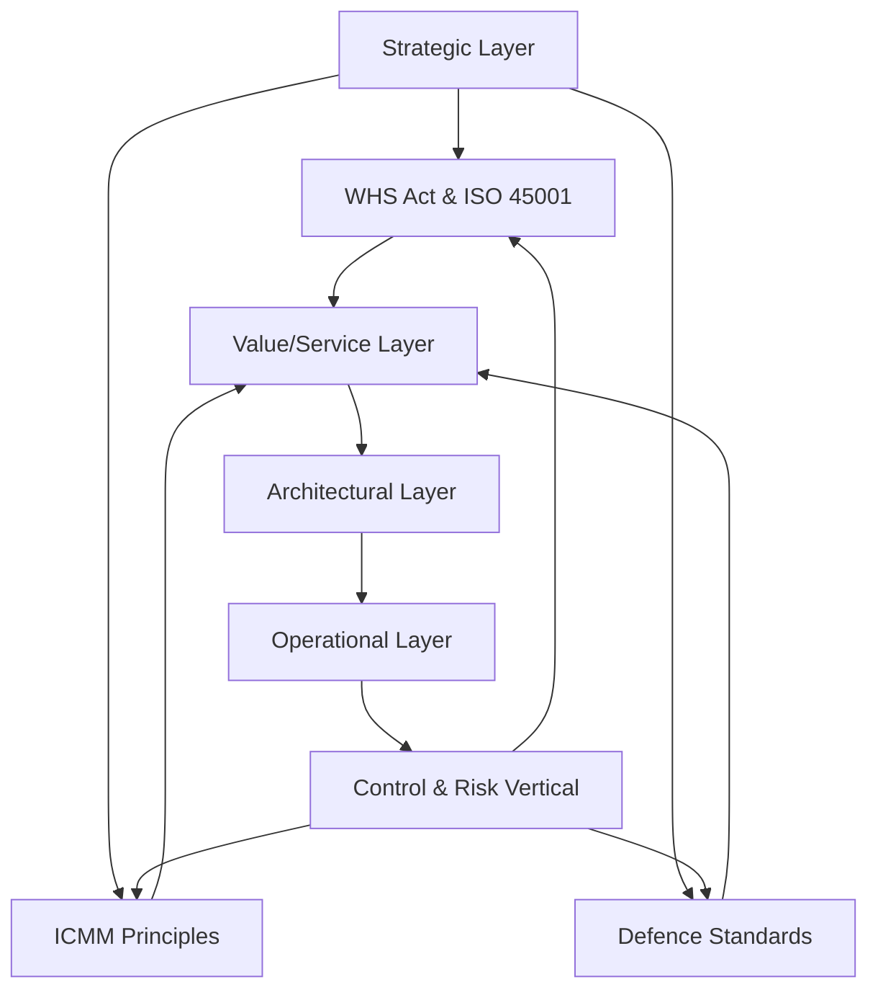

# Regulatory Standards Mapping

The CapOpt Platform is designed to support compliance with key regulatory and industry standards relevant to high-risk sectors:

- **WHS (Work Health and Safety) Act & Regulations (Australia)**
- **ISO 45001 (Occupational Health & Safety Management Systems)**
- **ICMM (International Council on Mining & Metals) Critical Control Management**
- **Defence Industry Security & Safety Standards**

## Standards Integration Across Layers

**Explanation:**
- Each platform layer is mapped to relevant standards, ensuring compliance is embedded by design.
- The Control & Risk vertical ensures continuous alignment and assurance across all standards. 