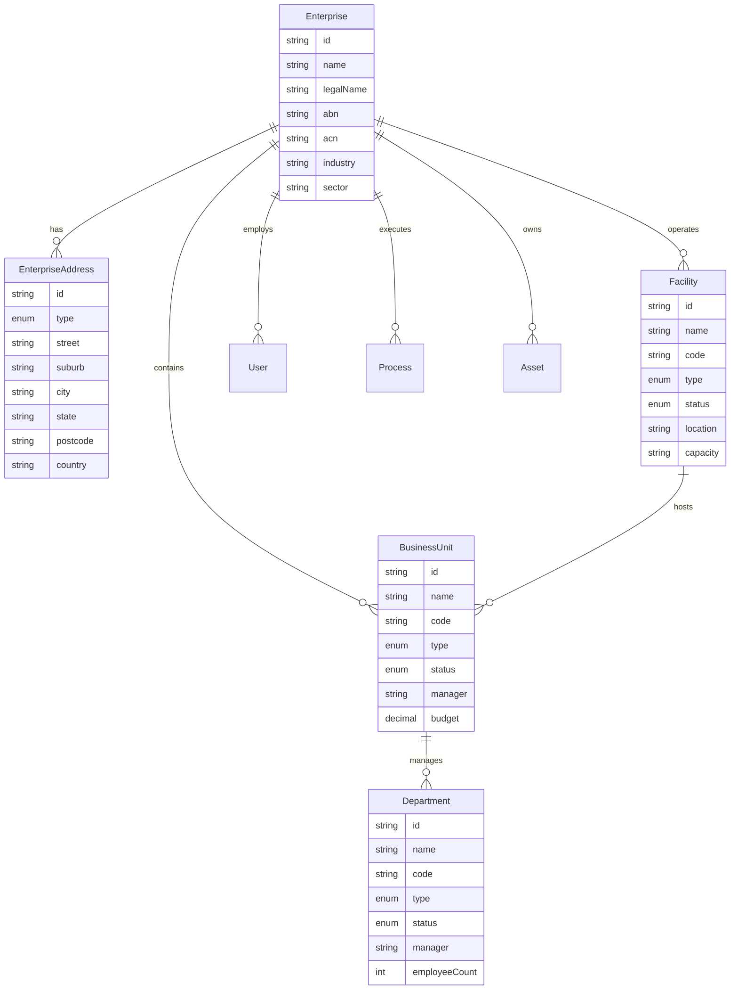
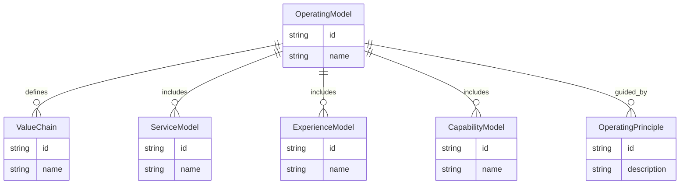
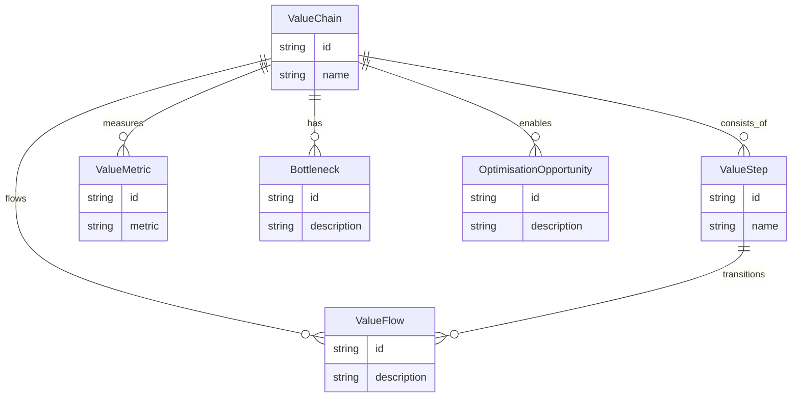
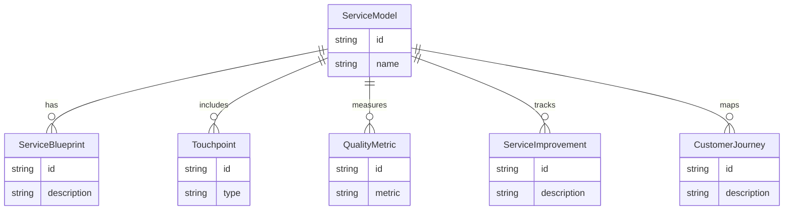
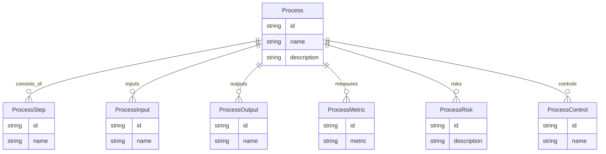
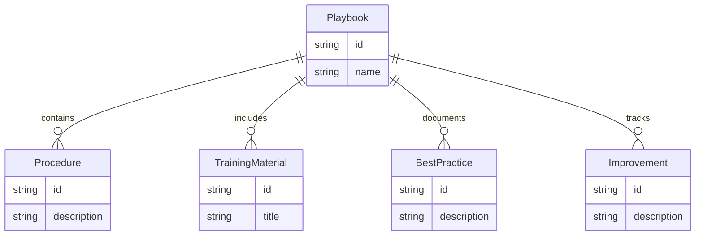
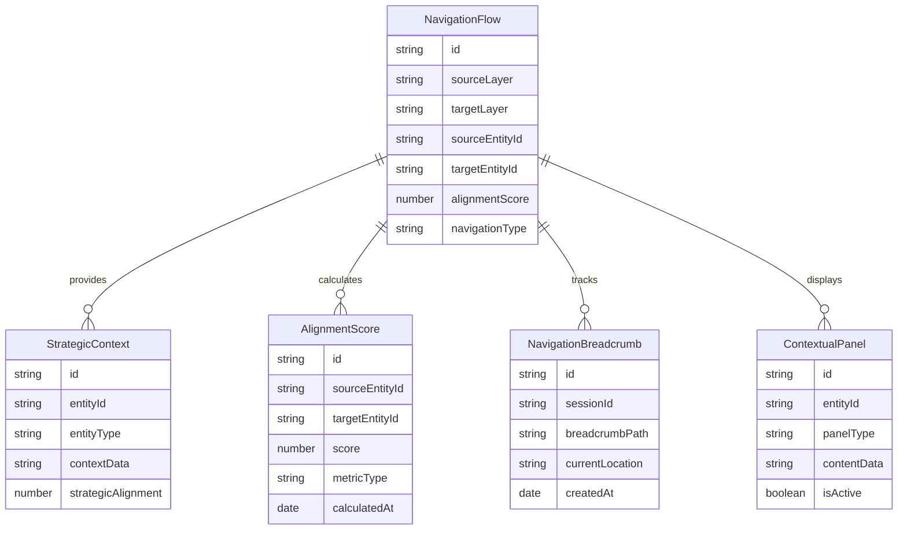
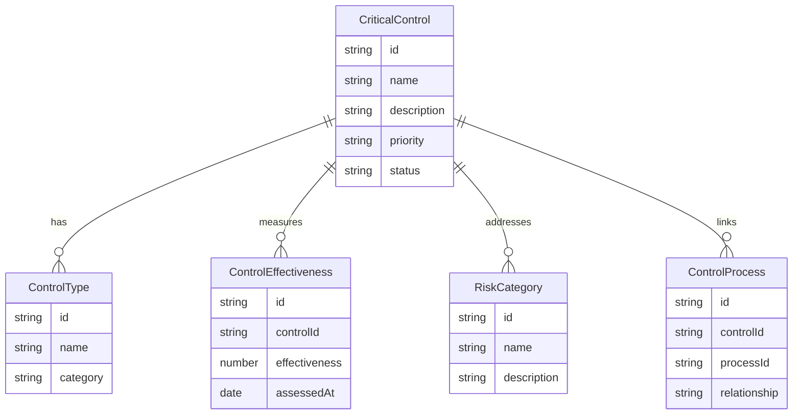
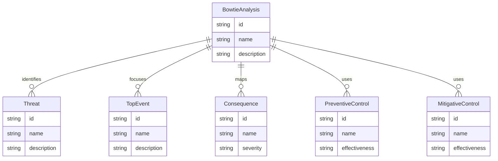

# CapOpt Platform Solution Architecture Design

## Executive Summary
The CapOpt platform is a comprehensive operational capability optimisation system designed to provide end-to-end visibility from strategic planning through operational execution, with integrated risk management and maturity-based improvement frameworks.

---

## 0. Enterprise Information System

### 0.1 Enterprise Management Module
**Purpose**: Multi-facility enterprise management with organizational hierarchy

**Key Entities:**
- Enterprise
- EnterpriseAddress
- Facility
- BusinessUnit
- Department

**ERD:**


### 0.2 Operational Streams
**Purpose**: Multi-stream operational management for complex mining operations

**Supported Streams:**
- **Copper Stream**: Flotation, smelting, refining processes
- **Uranium Stream**: Leaching, solvent extraction, precipitation
- **Gold Stream**: Recovery from copper, refining processes
- **Silver Stream**: Recovery from copper, refining processes

**Test Data Foundation:**
- **Enterprise**: Cracked Mountain Pty Ltd (CMP)
- **Facility**: Hercules Levee (HL001) - Based on Olympic Dam Mine
- **Location**: Roxby Downs, South Australia
- **Capacity**: 200,000 tonnes copper, 4,000 tonnes uranium, 80,000 oz gold, 800,000 oz silver annually

### 0.3 Organizational Hierarchy
**Purpose**: Comprehensive organizational structure management

**Business Units (12):**
- Mining Operations (MINING)
- Mineral Processing (PROCESSING)
- Metallurgy (METALLURGY)
- Maintenance (MAINTENANCE)
- Engineering (ENGINEERING)
- Safety & Health (SAFETY)
- Environmental (ENVIRONMENTAL)
- Finance (FINANCE)
- Human Resources (HR)
- Information Technology (IT)
- Logistics (LOGISTICS)
- Quality Assurance (QA)

**Departments (20+):**
Each business unit contains multiple departments with realistic staffing levels and management structures.

---

## 1. Strategic Layer

### 1.1 Business Canvas Module
**Purpose**: Strategic business model visualisation and management

**Key Entities:**
- BusinessCanvas
- ValueProposition
- CustomerSegment
- RevenueStream
- Partnership
- Resource
- Activity
- CostStructure
- Channel

**ERD:**


### 1.2 Operating Model Canvas Module
**Purpose**: Operational strategy and design framework

**Key Entities:**
- OperatingModel
- ValueChain
- ServiceModel
- ExperienceModel
- CapabilityModel
- OperatingPrinciple

**ERD:**


---

## 2. Value & Service Layer

### 2.1 Value Chain Engine
**Purpose**: Core value creation steps and flow management

**Key Entities:**
- ValueChain
- ValueStep
- ValueFlow
- ValueMetric
- Bottleneck
- OptimisationOpportunity

**ERD:**


### 2.2 Service Model Framework
**Purpose**: Service design and delivery management

**Key Entities:**
- ServiceModel
- ServiceBlueprint
- Touchpoint
- QualityMetric
- ServiceImprovement
- CustomerJourney

**ERD:**


---

## 3. Operational Layer

### 3.1 Process Management System
**Purpose**: Process mapping, documentation, and optimisation

**Key Entities:**
- Process
- ProcessStep
- ProcessInput
- ProcessOutput
- ProcessMetric
- ProcessRisk
- ProcessControl

**ERD:**


### 3.2 Playbook Management System
**Purpose**: Operational procedures and best practices

**Key Entities:**
- Playbook
- Procedure
- TrainingMaterial
- BestPractice
- Improvement

**ERD:**


---

## 4. Strategic Navigation Flow System

### 4.1 Navigation Flow Architecture
**Purpose**: Enable bidirectional navigation between operational and strategic layers, providing traceability and alignment visibility

**Key Components:**
- NavigationFlow
- StrategicContext
- AlignmentScore
- NavigationBreadcrumb
- ContextualPanel

**ERD:**


### 4.2 Navigation Flow Patterns

#### **Operational to Strategic Flow**
```
Process Maps → Service Model → Value Chain → Operating Model → Business Canvas
```

**Implementation:**
- **Process Maps**: Starting point with process detail views
- **Service Model**: Service blueprint with process linking
- **Value Chain**: Value flow visualization with optimization opportunities
- **Operating Model**: Operating principles and capability model
- **Business Canvas**: Strategic business model with operational impact

#### **Strategic to Operational Flow**
```
Business Canvas → Operating Model → Value Chain → Service Model → Process Maps
```

**Implementation:**
- **Business Canvas**: Strategic objectives and business model
- **Operating Model**: Operational strategy and design principles
- **Value Chain**: Value creation and flow management
- **Service Model**: Service delivery and customer experience
- **Process Maps**: Operational execution and process management

### 4.3 Navigation Flow Components

#### **Strategic Context Panel**
**Purpose**: Display strategic context for operational processes

**Features:**
- **Alignment Indicators**: Show strategic alignment percentages
- **Navigation Buttons**: Quick access to strategic layers
- **Context Information**: Relevant strategic context for current entity
- **Status Indicators**: Implementation status of navigation targets

**Implementation:**
```typescript
interface StrategicContextPanel {
  entityId: string
  entityType: 'process' | 'service' | 'valueChain' | 'operatingModel'
  alignmentScores: {
    serviceModel: number
    valueChain: number
    operatingModel: number
    businessCanvas: number
  }
  navigationTargets: {
    serviceModel: { id: string, implemented: boolean }
    valueChain: { id: string, implemented: boolean }
    operatingModel: { id: string, implemented: boolean }
    businessCanvas: { id: string, implemented: boolean }
  }
}
```

#### **Navigation Breadcrumbs**
**Purpose**: Provide clear navigation path through strategic layers

**Features:**
- **Layer Indicators**: Show current position in strategic hierarchy
- **Quick Navigation**: Click to navigate to any layer
- **Status Indicators**: Show implementation status of each layer
- **Context Preservation**: Maintain context when navigating

**Implementation:**
```typescript
interface NavigationBreadcrumb {
  path: Array<{
    layer: string
    entityId: string
    entityName: string
    implemented: boolean
  }>
  currentLayer: string
  currentEntityId: string
}
```

#### **Alignment Scoring System**
**Purpose**: Calculate and display strategic alignment between layers

**Metrics:**
- **Process-Service Alignment**: How well processes deliver services
- **Service-Value Alignment**: How well services create value
- **Value-Operating Alignment**: How well value aligns with operating principles
- **Operating-Strategic Alignment**: How well operations align with strategy

**Implementation:**
```typescript
interface AlignmentScore {
  sourceEntityId: string
  targetEntityId: string
  score: number // 0-100
  metrics: {
    processEfficiency: number
    strategicRelevance: number
    riskAlignment: number
    valueCreation: number
  }
  lastCalculated: Date
}
```

### 4.4 Navigation Flow API Design

#### **Navigation Flow Endpoints**
```typescript
// Get strategic context for an entity
GET /api/navigation/context/{entityType}/{entityId}

// Navigate between layers
POST /api/navigation/flow
{
  sourceLayer: string
  targetLayer: string
  sourceEntityId: string
  targetEntityId: string
}

// Get alignment scores
GET /api/navigation/alignment/{sourceEntityId}/{targetEntityId}

// Update navigation breadcrumb
POST /api/navigation/breadcrumb
{
  sessionId: string
  path: NavigationPath[]
}
```

#### **Strategic Context API**
```typescript
// Get strategic context for a process
GET /api/processes/{processId}/strategic-context

// Get linked strategic entities
GET /api/processes/{processId}/strategic-links

// Calculate alignment scores
POST /api/processes/{processId}/calculate-alignment
```

### 4.5 Navigation Flow User Experience

#### **Process Detail View Integration**
- **Strategic Context Panel**: Sidebar showing strategic alignment
- **Navigation Buttons**: Quick access to Service Model, Value Chain, etc.
- **Alignment Indicators**: Visual progress bars showing alignment scores
- **Breadcrumb Navigation**: Clear path through strategic layers

#### **Service Model View Integration**
- **Process Links**: Show linked processes that deliver the service
- **Value Chain Navigation**: Connect to value creation flow
- **Service Blueprint**: Visual service delivery process
- **Quality Metrics**: Service performance indicators

#### **Value Chain View Integration**
- **Service Links**: Show services that contribute to value creation
- **Operating Model Navigation**: Connect to operational strategy
- **Value Flow Visualization**: Visual value creation process
- **Optimization Opportunities**: Identify improvement areas

#### **Operating Model View Integration**
- **Value Chain Links**: Show value chains that align with operating principles
- **Business Canvas Navigation**: Connect to strategic business model
- **Capability Model**: Show organizational capabilities
- **Operating Principles**: Strategic operational guidelines

#### **Business Canvas View Integration**
- **Operating Model Links**: Show operating models that support business strategy
- **Strategic Impact Summary**: Show operational impact on strategy
- **Business Model Sections**: Complete business model canvas
- **Strategic Metrics**: Business performance indicators

### 4.6 Navigation Flow Implementation Status

#### **Phase 1 Implementation (Current)**
- ✅ **Process Maps**: 80% complete with navigation foundation
- ✅ **Business Canvas**: 100% complete
- 🚧 **Service Model**: 0% complete (Next priority)
- ⏳ **Value Chain**: 0% complete
- ⏳ **Operating Model**: 0% complete

#### **Phase 2 Implementation (Weeks 7-8)**
- **Service Model**: Complete implementation with process linking
- **Value Chain**: Foundation implementation with service linking
- **Navigation Integration**: Complete breadcrumb and contextual panels

#### **Phase 3 Implementation (Weeks 9-10)**
- **Value Chain**: Complete implementation with optimization features
- **Operating Model**: Complete implementation with capability model
- **Alignment Scoring**: Complete alignment calculation system

### 4.7 Navigation Flow Success Metrics

#### **User Experience Metrics**
- **Navigation Effectiveness**: Time to find strategic context
- **User Adoption**: Percentage of users using navigation flow weekly
- **Task Completion**: Success rate of strategic navigation tasks
- **User Satisfaction**: User feedback on navigation experience

#### **Business Impact Metrics**
- **Strategic Alignment**: Improvement in strategic-operational alignment
- **Decision Quality**: Faster strategic decision making
- **Process Optimization**: Better process-strategy alignment
- **Risk Management**: Improved risk-strategy alignment

#### **Technical Metrics**
- **Navigation Performance**: Page load times for navigation
- **Alignment Accuracy**: Accuracy of alignment calculations
- **System Reliability**: Navigation system uptime
- **Data Consistency**: Consistency of navigation data

---

## 5. Control & Risk Layer

### 5.1 Critical Control Management
**Purpose**: Identify, monitor, and assure critical controls

**Key Entities:**
- CriticalControl
- ControlType
- ControlEffectiveness
- RiskCategory
- ControlProcess

**ERD:**


### 5.2 Bowtie Analysis System
**Purpose**: Risk analysis and control mapping

**Key Entities:**
- BowtieAnalysis
- Threat
- TopEvent
- Consequence
- PreventiveControl
- MitigativeControl

**ERD:**


---

## 6. Integration Architecture

### 6.1 Layer Integration Patterns

#### **Strategic Navigation Integration**
- **Bidirectional Flow**: Enable navigation between all layers
- **Context Preservation**: Maintain context when navigating between layers
- **Alignment Tracking**: Track strategic alignment across layers
- **Impact Traceability**: Trace operational impact on strategic objectives

#### **Control Integration**
- **Cross-Layer Controls**: Apply controls across all layers
- **Risk Alignment**: Align risk management with strategic objectives
- **Compliance Tracking**: Track compliance across all layers
- **Assurance Integration**: Integrate assurance activities across layers

### 6.2 API Integration Patterns

#### **RESTful API Design**
- **Consistent Endpoints**: Standardized API patterns across all modules
- **Resource-Based URLs**: Clear resource identification in URLs
- **HTTP Status Codes**: Proper status code usage for responses
- **Error Handling**: Consistent error response formats

#### **GraphQL Integration**
- **Flexible Queries**: Allow clients to request specific data
- **Real-time Updates**: Subscription-based real-time updates
- **Schema Evolution**: Backward-compatible schema changes
- **Performance Optimization**: Efficient data fetching

### 6.3 Data Integration Patterns

#### **Event-Driven Architecture**
- **Domain Events**: Capture business events across all layers
- **Event Sourcing**: Maintain event history for audit and replay
- **CQRS Pattern**: Separate read and write operations
- **Event Streaming**: Real-time event processing

#### **Data Consistency**
- **Eventual Consistency**: Accept eventual consistency for better performance
- **Saga Pattern**: Handle distributed transactions across layers
- **Compensation Logic**: Handle rollback scenarios
- **Data Validation**: Ensure data integrity across layers

---

## 7. Security Architecture

### 7.1 Authentication & Authorization
- **JWT Tokens**: Secure token-based authentication
- **Role-Based Access Control**: Granular permission management
- **Multi-Factor Authentication**: Enhanced security for sensitive operations
- **Session Management**: Secure session handling

### 7.2 Data Protection
- **Encryption at Rest**: Encrypt sensitive data in storage
- **Encryption in Transit**: Secure data transmission
- **Data Classification**: Classify data by sensitivity level
- **Access Logging**: Comprehensive access audit trails

### 7.3 Compliance & Governance
- **Regulatory Compliance**: Meet industry-specific regulations
- **Audit Trails**: Complete audit trail for all operations
- **Data Retention**: Implement data retention policies
- **Privacy Protection**: Protect user privacy and data

---

## 8. Performance & Scalability

### 8.1 Performance Optimization
- **Caching Strategy**: Implement multi-level caching
- **Database Optimization**: Optimize database queries and indexing
- **CDN Integration**: Use CDN for static content delivery
- **Load Balancing**: Distribute load across multiple servers

### 8.2 Scalability Patterns
- **Horizontal Scaling**: Scale by adding more servers
- **Vertical Scaling**: Scale by increasing server resources
- **Microservices Architecture**: Decompose into microservices
- **Container Orchestration**: Use Kubernetes for container management

### 8.3 Monitoring & Observability
- **Application Monitoring**: Monitor application performance
- **Infrastructure Monitoring**: Monitor infrastructure health
- **Log Aggregation**: Centralized log management
- **Alerting**: Proactive alerting for issues

---

## 9. Deployment Architecture

### 9.1 Cloud Infrastructure
- **Azure Cloud Services**: Leverage Azure cloud capabilities
- **Container Deployment**: Deploy using Docker containers
- **Kubernetes Orchestration**: Use Kubernetes for container orchestration
- **Auto-scaling**: Implement automatic scaling based on demand

### 9.2 CI/CD Pipeline
- **Automated Testing**: Comprehensive automated testing
- **Continuous Integration**: Automated build and test process
- **Continuous Deployment**: Automated deployment to production
- **Environment Management**: Manage multiple deployment environments

### 9.3 Disaster Recovery
- **Backup Strategy**: Regular automated backups
- **Recovery Procedures**: Documented recovery procedures
- **High Availability**: Implement high availability patterns
- **Business Continuity**: Ensure business continuity during outages

---

## 10. Future Enhancements

### 10.1 AI/ML Integration
- **Predictive Analytics**: Predict operational issues and opportunities
- **Automated Optimization**: Automatically optimize processes and controls
- **Intelligent Recommendations**: Provide intelligent recommendations
- **Natural Language Processing**: Enable natural language interactions

### 10.2 Advanced Analytics
- **Real-time Analytics**: Real-time operational analytics
- **Advanced Reporting**: Advanced reporting and visualization
- **Data Mining**: Discover patterns and insights in data
- **Business Intelligence**: Comprehensive business intelligence capabilities

### 10.3 External Integrations
- **ERP Integration**: Integrate with enterprise resource planning systems
- **MES Integration**: Integrate with manufacturing execution systems
- **IoT Integration**: Integrate with Internet of Things devices
- **Third-party APIs**: Integrate with third-party services and APIs 