# CapOpt Platform Solution Architecture Design

## Executive Summary
The CapOpt platform is a comprehensive operational capability optimisation system designed to provide end-to-end visibility from strategic planning through operational execution, with integrated risk management and maturity-based improvement frameworks.

---

## 1. Strategic Layer

### 1.1 Business Canvas Module
**Purpose**: Strategic business model visualisation and management

**Key Entities:**
- BusinessCanvas
- ValueProposition
- CustomerSegment
- RevenueStream
- Partnership
- Resource
- Activity
- CostStructure
- Channel

**ERD:**
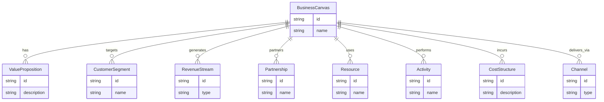

### 1.2 Operating Model Canvas Module
**Purpose**: Operational strategy and design framework

**Key Entities:**
- OperatingModel
- ValueChain
- ServiceModel
- ExperienceModel
- CapabilityModel
- OperatingPrinciple

**ERD:**
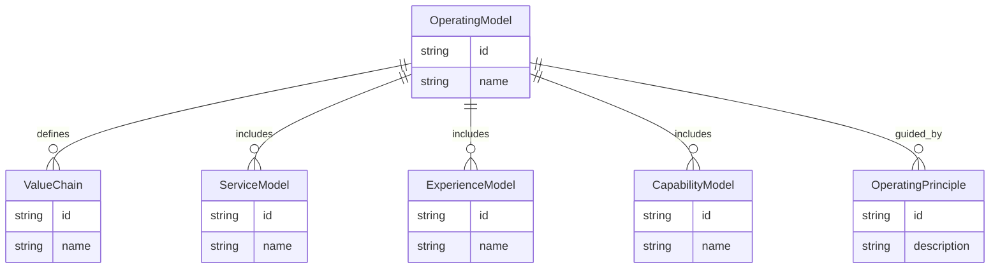

---

## 2. Value & Service Layer

### 2.1 Value Chain Engine
**Purpose**: Core value creation steps and flow management

**Key Entities:**
- ValueChain
- ValueStep
- ValueFlow
- ValueMetric
- Bottleneck
- OptimisationOpportunity

**ERD:**
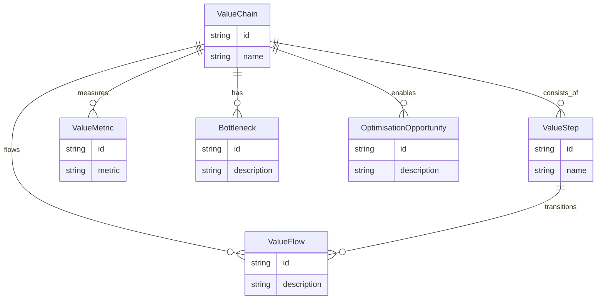

### 2.2 Service Model Framework
**Purpose**: Service design and delivery management

**Key Entities:**
- ServiceModel
- ServiceBlueprint
- Touchpoint
- QualityMetric
- ServiceImprovement
- CustomerJourney

**ERD:**
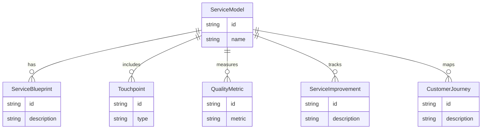

---

## 3. Operational Layer

### 3.1 Process Management System
**Purpose**: Process mapping, documentation, and optimisation

**Key Entities:**
- Process
- ProcessStep
- ProcessInput
- ProcessOutput
- ProcessMetric
- ProcessRisk
- ProcessControl

**ERD:**
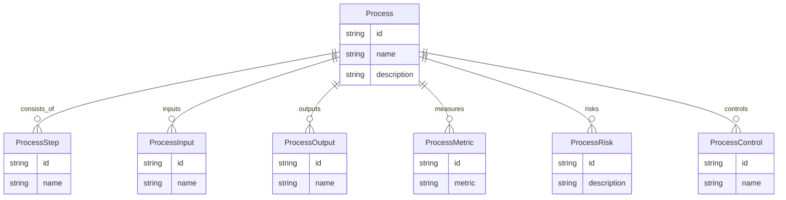

### 3.2 Playbook Management System
**Purpose**: Operational procedures and best practices

**Key Entities:**
- Playbook
- Procedure
- TrainingMaterial
- BestPractice
- Improvement

**ERD:**
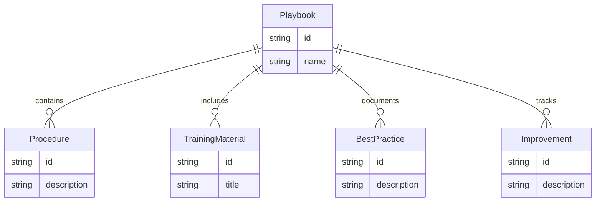

### 3.3 Maturity Assessment Engine
**Purpose**: Capability maturity evaluation and improvement tracking

**Key Entities:**
- MaturityAssessment
- CapabilityScore
- ImprovementRoadmap
- Benchmark
- Progress

**ERD:**
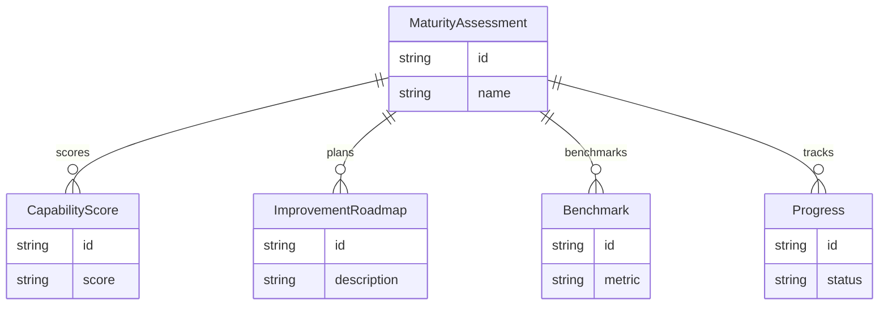

---

## 4. Control & Risk Layer

### 4.1 Critical Control Management System
**Purpose**: Risk controls and compliance management

**Key Entities:**
- CriticalControl
- RiskCategory
- ControlType
- ControlEffectiveness
- ComplianceStatus
- LinkedProcess
- LinkedAsset

**ERD:**
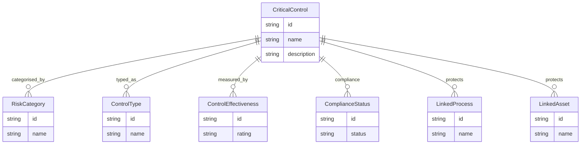

### 4.2 Asset Management System
**Purpose**: Critical asset identification and protection

**Key Entities:**
- Asset
- AssetRisk
- AssetProtection
- AssetMonitor
- AssetOptimisation

**ERD:**
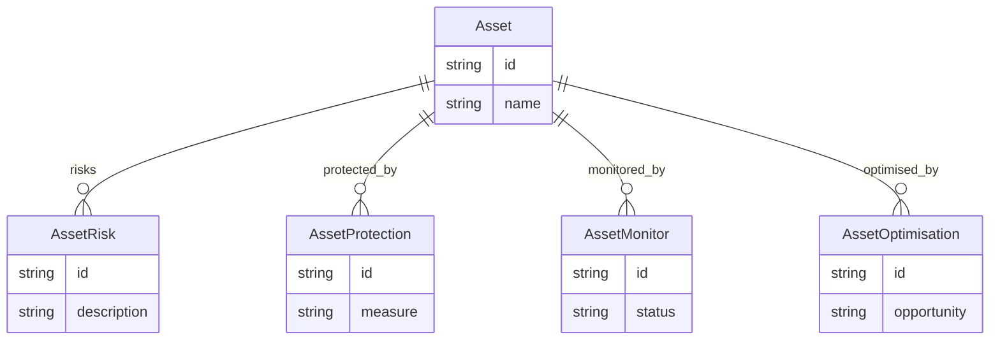

---

## 5. Integration & Analytics Layer

### 5.1 Cross-Layer Integration Engine
**Purpose**: Connect all layers for comprehensive analysis

**Key Entities:**
- StrategicOperationalMap
- ProcessControlLink
- ValueChainProcessMap
- AssetProcessRelation
- Traceability

**ERD:**
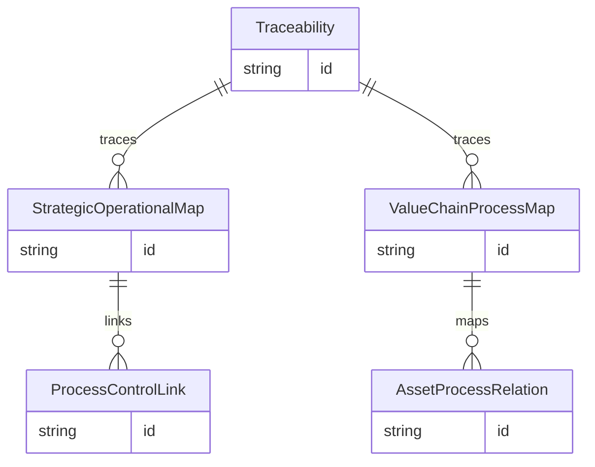

### 5.2 Analytics Engine & Reporting System
**Purpose**: Data analysis, insights, and reporting

**Key Entities:**
- AnalyticsJob
- Report
- Dashboard
- KPI
- Trend
- Prediction

**ERD:**
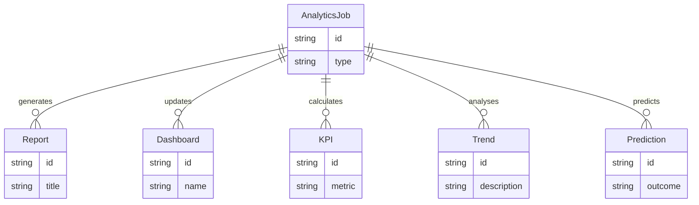

---

## 6. Technical Architecture

### Frontend Architecture
**Technology Stack**:
- React 18+ with TypeScript
- Next.js 15+ for SSR and routing
- Tailwind CSS for styling
- Shadcn/ui for component library
- React Query for state management
- React Hook Form for form handling

**Key Components**:
- Responsive design system
- Accessibility compliance (WCAG 2.1)
- Progressive Web App capabilities
- Offline functionality
- Real-time updates

### Backend Architecture
**Technology Stack**:
- Node.js with TypeScript
- Express.js or Fastify for API
- PostgreSQL for primary database
- Redis for caching and sessions
- Prisma for ORM
- JWT for authentication

**API Design**:
- RESTful API with GraphQL option
- OpenAPI/Swagger documentation
- Rate limiting and security
- API versioning
- Comprehensive error handling

### Data Architecture
**Database Design**:
- Normalized relational schema
- Audit trails for all changes
- Soft deletes for data retention
- Optimized indexes for performance
- Data archiving strategy

**Data Models**:
- Entity-relationship diagrams
- Data dictionaries
- Data quality rules
- Data governance policies
- Data lineage tracking

### Security Architecture
**Authentication & Authorization**:
- Multi-factor authentication
- Role-based access control (RBAC)
- Attribute-based access control (ABAC)
- Single sign-on (SSO) integration
- Session management

**Data Protection**:
- Encryption at rest and in transit
- Data masking for sensitive information
- Audit logging for compliance
- Data backup and recovery
- Privacy by design principles

## Deployment Architecture

### Infrastructure
**Cloud Platform**: AWS, Azure, or GCP
**Containerization**: Docker with Kubernetes
**CI/CD**: GitHub Actions or GitLab CI
**Monitoring**: Prometheus, Grafana, ELK Stack
**Logging**: Centralized logging with correlation IDs

### Scalability
**Horizontal Scaling**: Auto-scaling groups
**Load Balancing**: Application load balancers
**Caching**: Multi-layer caching strategy
**Database**: Read replicas and connection pooling
**CDN**: Content delivery network for static assets

### High Availability
**Multi-AZ Deployment**: Across availability zones
**Backup Strategy**: Automated backups with point-in-time recovery
**Disaster Recovery**: RTO/RPO objectives defined
**Health Checks**: Comprehensive health monitoring
**Circuit Breakers**: Fault tolerance patterns

## Integration Architecture

### External Systems Integration
**ERP Systems**: SAP, Oracle, Microsoft Dynamics
**MES Systems**: Manufacturing execution systems
**SCADA Systems**: Supervisory control and data acquisition
**PLM Systems**: Product lifecycle management
**CRM Systems**: Customer relationship management

### API Integration
**REST APIs**: Standard HTTP APIs
**GraphQL**: Flexible data querying
**Webhooks**: Real-time event notifications
**Message Queues**: Asynchronous processing
**Event Streaming**: Real-time data pipelines

## Performance Architecture

### Performance Optimization
**Frontend**: Code splitting, lazy loading, image optimization
**Backend**: Database query optimization, caching strategies
**Network**: CDN, compression, HTTP/2
**Database**: Indexing, query optimization, connection pooling
**Monitoring**: Performance metrics and alerting

### Scalability Patterns
**Microservices**: Service decomposition
**Event-Driven**: Asynchronous processing
**CQRS**: Command Query Responsibility Segregation
**Event Sourcing**: Audit trail and state reconstruction
**Saga Pattern**: Distributed transaction management

## Monitoring & Observability

### Application Monitoring
**Metrics**: Custom business metrics
**Logging**: Structured logging with correlation IDs
**Tracing**: Distributed tracing with OpenTelemetry
**Alerting**: Proactive alerting with escalation
**Dashboards**: Real-time operational dashboards

### Business Intelligence
**Data Warehouse**: Centralized data repository
**ETL Processes**: Data extraction, transformation, loading
**Reporting**: Automated report generation
**Analytics**: Advanced analytics and machine learning
**Visualization**: Interactive dashboards and charts

## Compliance & Governance

### Regulatory Compliance
**Data Protection**: GDPR, CCPA compliance
**Industry Standards**: ISO 27001, SOC 2
**Audit Requirements**: Comprehensive audit trails
**Data Retention**: Automated data lifecycle management
**Privacy Controls**: Data minimization and purpose limitation

### Governance Framework
**Change Management**: Controlled deployment processes
**Access Management**: Regular access reviews
**Data Governance**: Data quality and lineage
**Risk Management**: Continuous risk assessment
**Compliance Monitoring**: Automated compliance checking

## Future Considerations

### Technology Evolution
**AI/ML Integration**: Predictive analytics and automation
**Blockchain**: Immutable audit trails
**IoT Integration**: Real-time sensor data
**Edge Computing**: Local processing capabilities
**Quantum Computing**: Future-proofing considerations

### Scalability Planning
**Global Expansion**: Multi-region deployment
**User Growth**: Performance under load
**Feature Expansion**: Modular architecture
**Integration Growth**: API ecosystem
**Data Growth**: Storage and processing optimization

This architecture provides a solid foundation for the CapOpt platform, ensuring scalability, maintainability, and alignment with business objectives while maintaining security and compliance requirements. 

## Entity Relationship Diagram (ERD)

```mermaid
erDiagram
    BusinessCanvas {
        string id
        string name
    }
    OperatingModel {
        string id
        string name
    }
    ValueChain {
        string id
        string name
    }
    Process {
        string id
        string name
        string description
    }
    CriticalControl {
        string id
        string name
        string description
    }
    Asset {
        string id
        string name
    }
    RiskCategory {
        string id
        string name
    }
    ControlType {
        string id
        string name
    }
    ControlEffectiveness {
        string id
        string rating
    }
    ComplianceStatus {
        string id
        string status
    }
    // Relationships
    BusinessCanvas ||--o{ ValueChain : contains
    ValueChain ||--o{ Process : includes
    Process ||--o{ CriticalControl : has
    CriticalControl ||--o{ RiskCategory : categorised_by
    CriticalControl ||--o{ ControlType : typed_as
    CriticalControl ||--o{ ControlEffectiveness : measured_by
    CriticalControl ||--o{ ComplianceStatus : compliance
    CriticalControl ||--o{ Asset : protects
    Asset ||--o{ Process : used_in
    OperatingModel ||--o{ ValueChain : defines
``` 

## Detailed Systems Architecture

```mermaid
graph TD
  subgraph Frontend
    FE[React/Next.js UI]
    PWA[Progressive Web App]
    ACC[Accessibility Layer]
  end
  subgraph Backend
    API[Node.js API (Express/Fastify)]
    AUTH[Auth Service (JWT, SSO, RBAC)]
    ORM[Prisma ORM]
    CACHE[Redis Cache]
    WORKER[Background Workers]
  end
  subgraph Database
    PG[(PostgreSQL)]
  end
  subgraph Integration
    ERP[ERP Integration]
    MES[MES Integration]
    SCADA[SCADA Integration]
    PLM[PLM Integration]
    CRM[CRM Integration]
    EXTAPI[External APIs]
  end
  subgraph Analytics
    DW[Data Warehouse]
    ETL[ETL Pipeline]
    BI[BI & Dashboards]
    ML[AI/ML Engine]
  end
  subgraph Security
    SEC[Security Layer]
    AUDIT[Audit Logging]
    ENCRYPT[Encryption]
  end
  subgraph Deployment
    DOCKER[Docker/Kubernetes]
    CI[CI/CD Pipeline]
    MON[Monitoring (Prometheus/Grafana)]
    LOG[Centralised Logging (ELK)]
  end

  FE -->|REST/GraphQL| API
  FE -->|WebSockets| API
  PWA --> FE
  ACC --> FE
  API --> ORM
  API --> AUTH
  API --> CACHE
  API --> WORKER
  ORM --> PG
  AUTH --> PG
  CACHE --> PG
  WORKER --> PG
  API -->|Integrates| ERP
  API --> MES
  API --> SCADA
  API --> PLM
  API --> CRM
  API --> EXTAPI
  API --> DW
  DW --> ETL
  ETL --> BI
  BI --> ML
  API --> SEC
  SEC --> AUDIT
  SEC --> ENCRYPT
  API --> DOCKER
  API --> CI
  API --> MON
  API --> LOG
```

### Component Descriptions

- **Frontend**: React/Next.js UI, PWA features, accessibility compliance
- **Backend**: Node.js API, authentication/authorisation, ORM, caching, background workers
- **Database**: PostgreSQL for transactional data
- **Integration**: Connectors for ERP, MES, SCADA, PLM, CRM, and external APIs
- **Analytics**: Data warehouse, ETL, BI dashboards, AI/ML engine
- **Security**: Security layer, audit logging, encryption
- **Deployment**: Docker/Kubernetes, CI/CD, monitoring, centralised logging

All components are designed for scalability, security, and compliance with high-risk industry requirements. 

## Key Workflow Sequence Diagrams

### 1. Risk Assessment and Critical Control Assurance

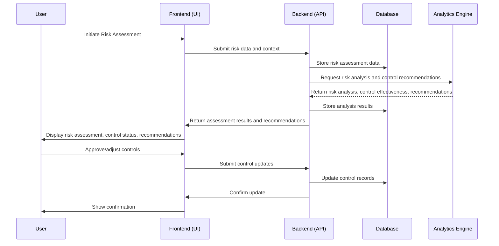

### 2. Incident Reporting and Response

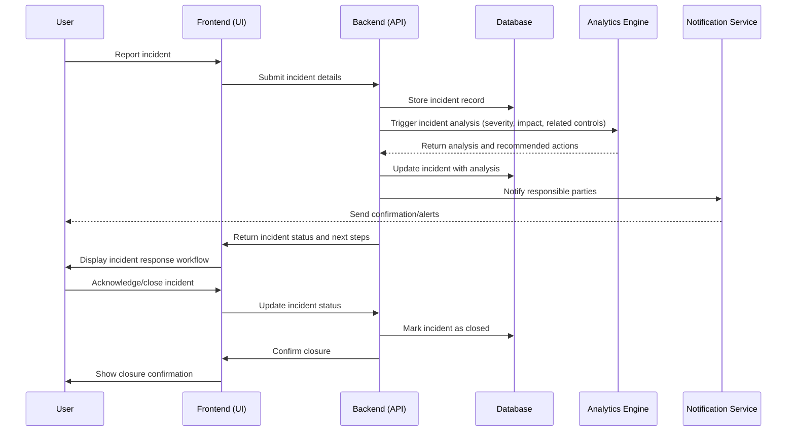

### 3. Compliance Audit Workflow

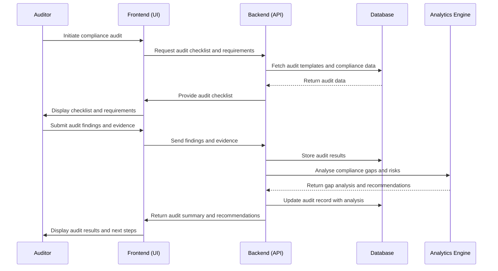

### 4. Asset Risk Assessment and Protection

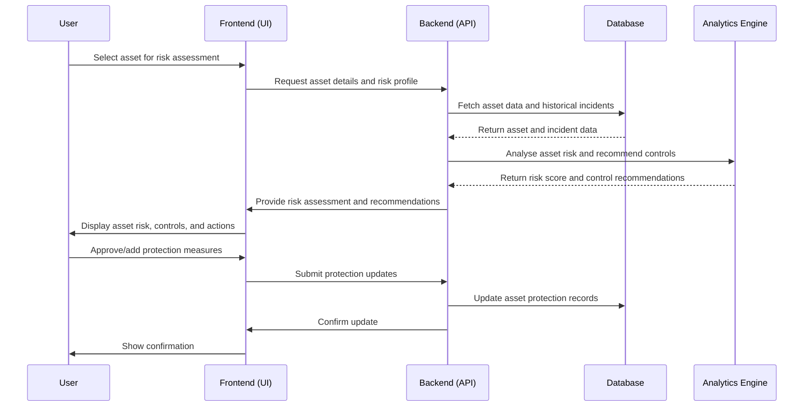

### 5. User Onboarding and Role Assignment

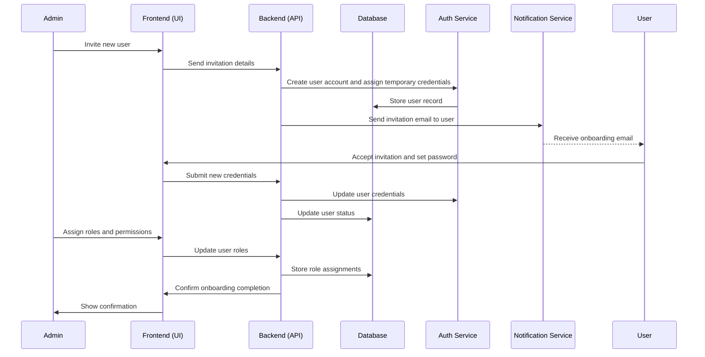

### 6. Maturity Assessment and Improvement Roadmap

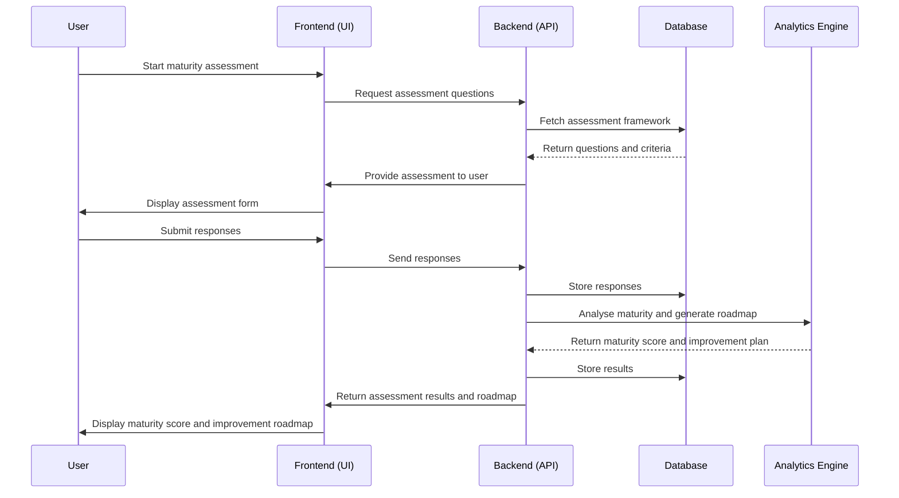

## Error Handling and Exception Workflows

### Principles
- All errors are logged with context and correlation IDs for traceability.
- User-facing errors are clear, actionable, and never expose sensitive details.
- System errors trigger alerts and, where appropriate, automated recovery or escalation.
- Critical errors (e.g., control failures, data loss) follow strict escalation and notification protocols.
- All error flows are tested, monitored, and reviewed regularly.

### Common Error Types
- **Validation Errors:** Invalid user input, missing required fields
- **Authentication/Authorisation Errors:** Invalid credentials, insufficient permissions
- **System Errors:** Database or service outages, timeouts
- **Integration Errors:** Failed connections to external systems (ERP, MES, etc.)
- **Business Logic Errors:** Violations of business rules, control failures
- **Critical Incidents:** Loss of control effectiveness, unmitigated risks

### 1. API Error Handling and User Feedback

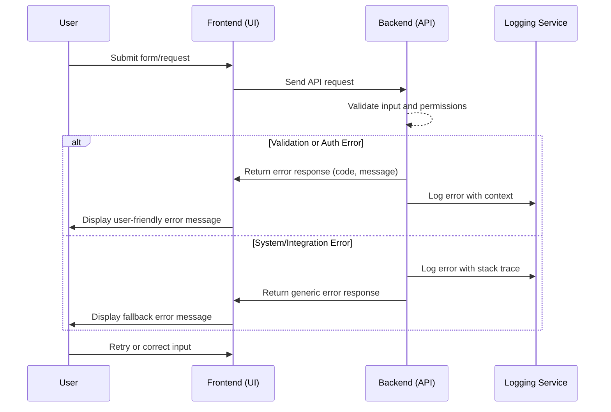

### 2. Critical Control Failure Escalation

```mermaid
sequenceDiagram
    participant Monitor as Control Monitor
    participant API as Backend (API)
    participant LOG as Logging Service
    participant NOTIF as Notification Service
    participant FE as Frontend (UI)
    participant User
    participant Manager

    Monitor->>API: Detect control failure event
    API->>LOG: Log critical event with details
    API->>NOTIF: Trigger escalation notification
    NOTIF-->>User: Notify responsible user(s)
    NOTIF-->>Manager: Notify manager/escalation contact
    API->>FE: Update dashboard/status
    FE->>User: Display critical control failure alert
    User->>FE: Acknowledge/assign response
    FE->>API: Record acknowledgement/action
    API->>LOG: Log response action
``` 

## User Persona Journey Diagrams

**Legend:**
- ⚠️ Pain Point
- ⭐ Opportunity

### 1. Strategic Planner Journey

```mermaid
journey
    title Strategic Planner: From Strategy to Execution
    section Login & Orientation
      Login to platform: 5: User
      Review dashboard: 4: User ⚠️ (Information overload)
    section Strategic Planning
      Access Business Canvas: 5: User
      Map value propositions: 4: User ⭐ (Strategic clarity)
      Define strategic objectives: 4: User
    section Alignment & Analysis
      Link strategy to operating model: 3: User ⚠️ (Alignment complexity)
      Review risk controls: 3: User ⭐ (Integrated risk view)
      Analyse strategic risks: 2: User ⚠️ (Uncertain risk data)
    section Execution & Monitoring
      Assign initiatives: 4: User
      Monitor progress: 3: User ⭐ (Real-time tracking)
      Review reports: 4: User
```

### 2. Operations Manager Journey

```mermaid
journey
    title Operations Manager: Process Optimisation & Control
    section Start of Day
      Login to platform: 5: User
      Review operational dashboard: 4: User ⚠️ (Alert fatigue)
    section Process Management
      Access process maps: 4: User
      Identify bottlenecks: 3: User ⭐ (Bottleneck detection)
      Review critical controls: 3: User ⚠️ (Control gaps)
      Assign tasks to team: 4: User ⭐ (Task automation)
    section Incident Handling
      Respond to incident alert: 2: User ⚠️ (Incident stress)
      Review incident details: 2: User
      Implement corrective actions: 3: User ⭐ (Guided response)
    section Continuous Improvement
      Track KPIs: 4: User
      Review improvement roadmap: 4: User ⭐ (Continuous improvement)
      Share feedback: 5: User
```

### 3. Risk Manager Journey

```mermaid
journey
    title Risk Manager: Assurance & Compliance
    section Daily Routine
      Login to platform: 5: User
      Review risk dashboard: 4: User ⚠️ (Risk overload)
    section Risk Assessment
      Conduct risk assessment: 3: User ⭐ (Automated scoring)
      Review control effectiveness: 3: User ⚠️ (Data gaps)
      Update risk register: 3: User
    section Audit & Compliance
      Initiate compliance audit: 2: User
      Review audit findings: 2: User ⚠️ (Audit backlog)
      Escalate critical issues: 1: User ⭐ (Escalation workflow)
    section Reporting
      Generate compliance reports: 4: User
      Present to management: 4: User ⭐ (Board-ready reports)
      Plan risk mitigation: 3: User
``` 

### 4. Analyst Journey

```mermaid
journey
    title Analyst: Insights & Reporting
    section Start of Day
      Login to platform: 5: User
      Review analytics dashboard: 4: User
    section Data Exploration
      Access data warehouse: 3: User
      Query operational data: 3: User ⚠️ (Data complexity)
      Visualise trends: 4: User ⭐ (Advanced visualisation)
    section Insights Generation
      Run predictive analytics: 3: User ⭐ (AI/ML tools)
      Identify anomalies: 2: User ⚠️ (Data quality)
      Generate reports: 4: User
    section Collaboration
      Share insights with team: 4: User ⭐ (Collaboration tools)
      Receive feedback: 3: User
```

**Workflow/Feature Links:**
| Journey Step                | Platform Workflow/Feature           |
|----------------------------|-------------------------------------|
| Review analytics dashboard  | Analytics Engine, KPI Dashboards    |
| Access data warehouse       | Data Warehouse, ETL Pipeline        |
| Query operational data      | BI Tools, Data Query Interface      |
| Visualise trends            | BI Dashboards, Charting Tools       |
| Run predictive analytics    | AI/ML Engine                        |
| Identify anomalies          | Data Quality & Monitoring           |
| Generate reports            | Reporting System                    |
| Share insights with team    | Collaboration/Sharing Tools         |
| Receive feedback            | Comments, Notifications             |

### 5. Executive Journey

```mermaid
journey
    title Executive: Oversight & Decision-Making
    section Daily Overview
      Login to platform: 5: User
      Review executive dashboard: 4: User
    section Strategic Review
      Assess risk posture: 3: User ⭐ (Risk heatmaps)
      Review compliance status: 3: User ⚠️ (Regulatory complexity)
      Monitor key initiatives: 4: User
    section Decision-Making
      Approve strategic actions: 3: User
      Request additional analysis: 2: User ⚠️ (Information gaps)
      Communicate decisions: 4: User ⭐ (Integrated comms)
    section Stakeholder Engagement
      Share reports with board: 4: User ⭐ (Board reporting)
      Respond to queries: 3: User
```

**Workflow/Feature Links:**
| Journey Step                | Platform Workflow/Feature           |
|----------------------------|-------------------------------------|
| Review executive dashboard  | Executive Dashboard, KPI Reporting  |
| Assess risk posture         | Risk Dashboard, Heatmaps            |
| Review compliance status    | Compliance Monitoring, Audit Trails |
| Monitor key initiatives     | Initiative Tracker, Progress Reports|
| Approve strategic actions   | Approval Workflow                   |
| Request additional analysis | Analytics Engine, BI Tools          |
| Communicate decisions       | Integrated Communication Tools      |
| Share reports with board    | Board Reporting, Export Tools       |
| Respond to queries          | Notifications, Messaging            |
``` 

---

## Cross-Layer Relationship Diagrams

### 1. ValueChain, Process, and Playbook Linkage
```mermaid
erDiagram
    ValueChain {
        string id
        string name
    }
    Process {
        string id
        string name
    }
    Playbook {
        string id
        string name
    }
    ValueChain ||--o{ Process : includes
    Process ||--o{ Playbook : guided_by
```

### 2. CriticalControl, Process, and Asset Linkage
```mermaid
erDiagram
    CriticalControl {
        string id
        string name
    }
    Process {
        string id
        string name
    }
    Asset {
        string id
        string name
    }
    CriticalControl ||--o{ Process : protects
    CriticalControl ||--o{ Asset : protects
    Process ||--o{ Asset : uses
```

---

## Example Data Dictionaries

### BusinessCanvas
| Attribute         | Type    | Description                                 |
|------------------|---------|---------------------------------------------|
| id               | string  | Unique identifier for the business canvas   |
| name             | string  | Name of the business canvas                 |
| valueProposition | string  | Reference to value proposition entity       |
| customerSegments | array   | List of customer segment references         |
| revenueStreams   | array   | List of revenue stream references           |
| keyPartnerships  | array   | List of partnership references              |
| keyResources     | array   | List of resource references                 |
| keyActivities    | array   | List of activity references                 |
| costStructure    | string  | Reference to cost structure entity          |
| channels         | array   | List of channel references                  |

### ValueChain
| Attribute         | Type    | Description                                 |
|------------------|---------|---------------------------------------------|
| id               | string  | Unique identifier for the value chain       |
| name             | string  | Name of the value chain                     |
| steps            | array   | List of value step references               |
| flows            | array   | List of value flow references               |
| metrics          | array   | List of value metric references             |
| bottlenecks      | array   | List of bottleneck references               |
| optimisationOpportunities | array | List of optimisation opportunity references |

### Process
| Attribute         | Type    | Description                                 |
|------------------|---------|---------------------------------------------|
| id               | string  | Unique identifier for the process           |
| name             | string  | Name of the process                         |
| description      | string  | Description of the process                  |
| steps            | array   | List of process step references             |
| inputs           | array   | List of process input references            |
| outputs          | array   | List of process output references           |
| metrics          | array   | List of process metric references           |
| risks            | array   | List of process risk references             |
| controls         | array   | List of process control references          |

### CriticalControl
| Attribute         | Type    | Description                                 |
|------------------|---------|---------------------------------------------|
| id               | string  | Unique identifier for the critical control  |
| name             | string  | Name of the critical control                |
| description      | string  | Description of the control                  |
| riskCategory     | string  | Reference to risk category entity           |
| controlType      | string  | Reference to control type entity            |
| effectiveness    | string  | Reference to control effectiveness entity   |
| complianceStatus | string  | Reference to compliance status entity       |
| linkedProcesses  | array   | List of linked process references           |
| linkedAssets     | array   | List of linked asset references             |

### ServiceModel
| Attribute         | Type    | Description                                 |
|------------------|---------|---------------------------------------------|
| id               | string  | Unique identifier for the service model     |
| name             | string  | Name of the service model                   |
| blueprints       | array   | List of service blueprint references        |
| touchpoints      | array   | List of touchpoint references               |
| qualityMetrics   | array   | List of quality metric references           |
| improvements     | array   | List of service improvement references      |
| customerJourneys | array   | List of customer journey references         |

### Playbook
| Attribute         | Type    | Description                                 |
|------------------|---------|---------------------------------------------|
| id               | string  | Unique identifier for the playbook          |
| name             | string  | Name of the playbook                        |
| procedures       | array   | List of procedure references                |
| trainingMaterials| array   | List of training material references        |
| bestPractices    | array   | List of best practice references            |
| improvements     | array   | List of improvement references              |

### Asset
| Attribute         | Type    | Description                                 |
|------------------|---------|---------------------------------------------|
| id               | string  | Unique identifier for the asset             |
| name             | string  | Name of the asset                           |
| risks            | array   | List of asset risk references               |
| protections      | array   | List of asset protection references         |
| monitors         | array   | List of asset monitor references            |
| optimisations    | array   | List of asset optimisation references       |

### AnalyticsJob
| Attribute         | Type    | Description                                 |
|------------------|---------|---------------------------------------------|
| id               | string  | Unique identifier for the analytics job     |
| type             | string  | Type of analytics job (e.g., KPI, trend)    |
| targetEntity     | string  | Reference to the entity being analysed      |
| parameters       | object  | Parameters for the analytics job            |
| status           | string  | Status of the analytics job                 |
| results          | object  | Results of the analytics job                |

### Report
| Attribute         | Type    | Description                                 |
|------------------|---------|---------------------------------------------|
| id               | string  | Unique identifier for the report            |
| title            | string  | Title of the report                         |
| type             | string  | Type of report (e.g., operational, risk)    |
| generatedBy      | string  | Reference to the analytics job              |
| relatedEntities  | array   | List of related entity references           |
| createdAt        | date    | Date/time the report was generated          |
``` 

---

## Expanded Cross-Layer Relationship Diagrams

### 3. Analytics, Reporting, and Integration Linkage
```mermaid
erDiagram
    Process {
        string id
        string name
    }
    ValueChain {
        string id
        string name
    }
    Asset {
        string id
        string name
    }
    AnalyticsJob {
        string id
        string type
    }
    Report {
        string id
        string title
    }
    Process ||--o{ AnalyticsJob : analysed_by
    ValueChain ||--o{ AnalyticsJob : analysed_by
    Asset ||--o{ AnalyticsJob : analysed_by
    AnalyticsJob ||--o{ Report : generates
    Report ||--o{ Process : reports_on
    Report ||--o{ ValueChain : reports_on
    Report ||--o{ Asset : reports_on
```

**Example Usage Scenario:**
- An AnalyticsJob is created to analyse a specific Process (e.g., "Ore Refinement"). The job runs a KPI analysis and generates a Report (e.g., "Monthly Refinement Efficiency"). The Report references both the Process and the ValueChain it belongs to, and may also include Asset performance data.

- Another AnalyticsJob targets an Asset (e.g., "Conveyor Belt 3"), running a trend analysis on downtime. The resulting Report links to the Asset and any related Processes.
``` 