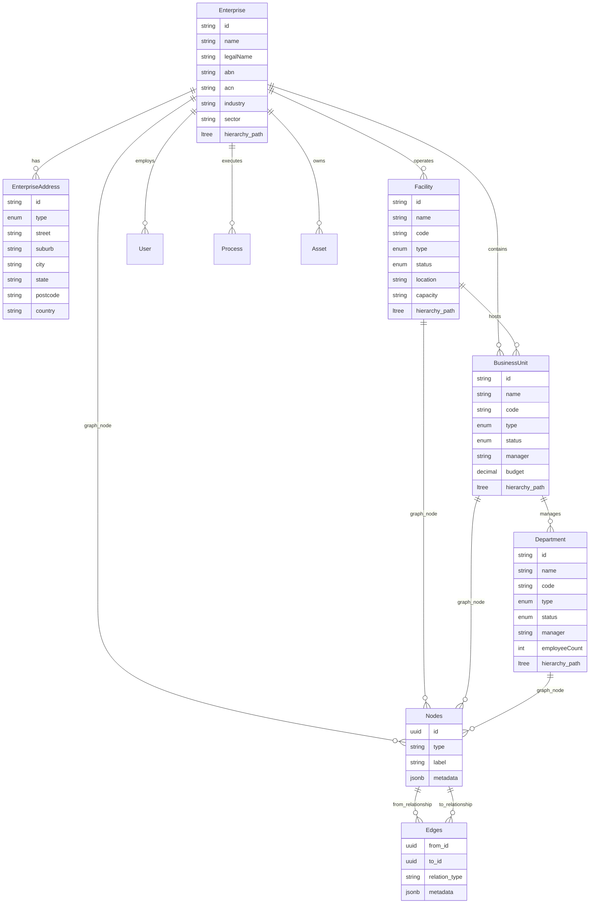
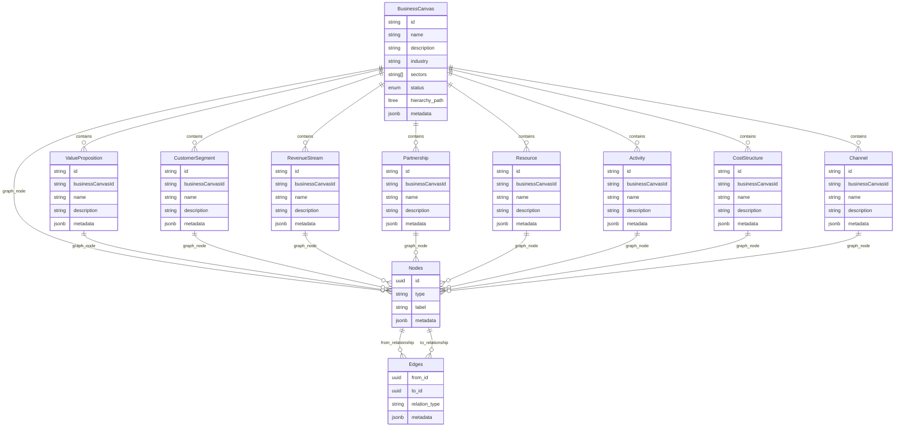
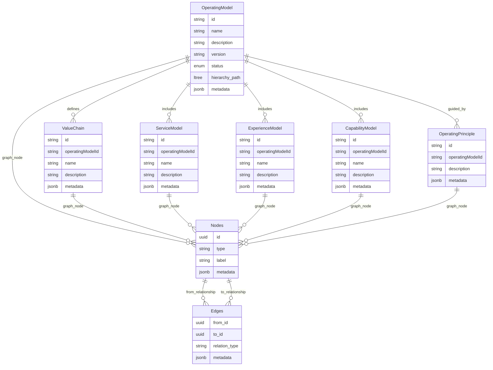
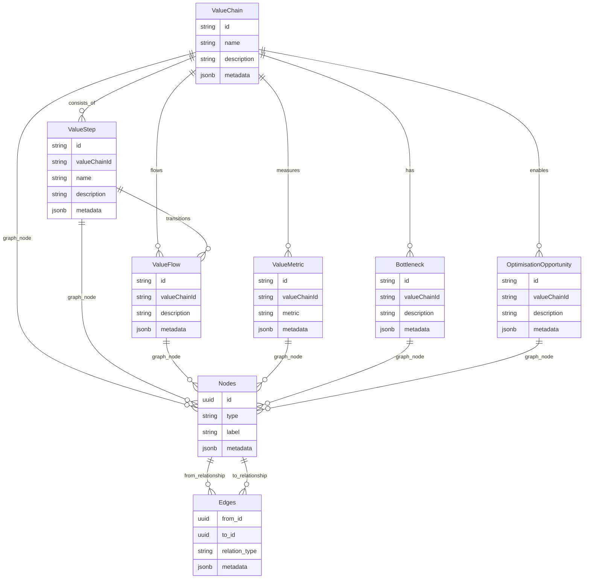
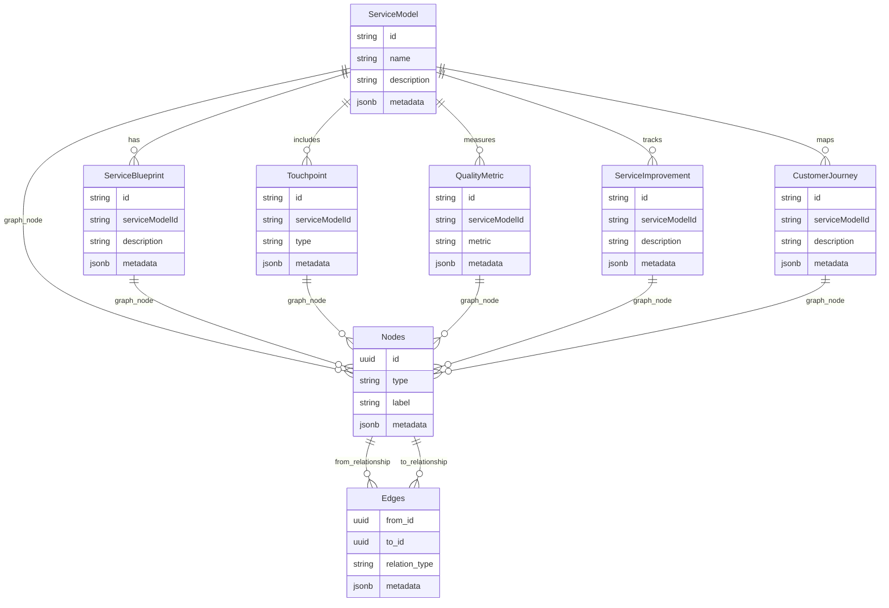
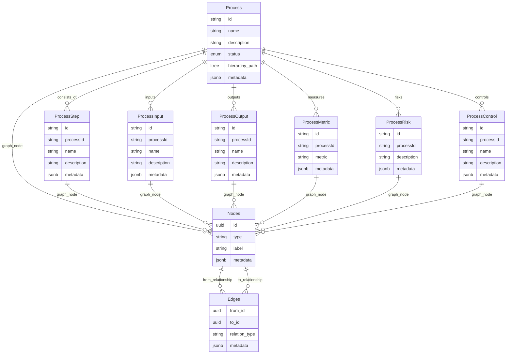
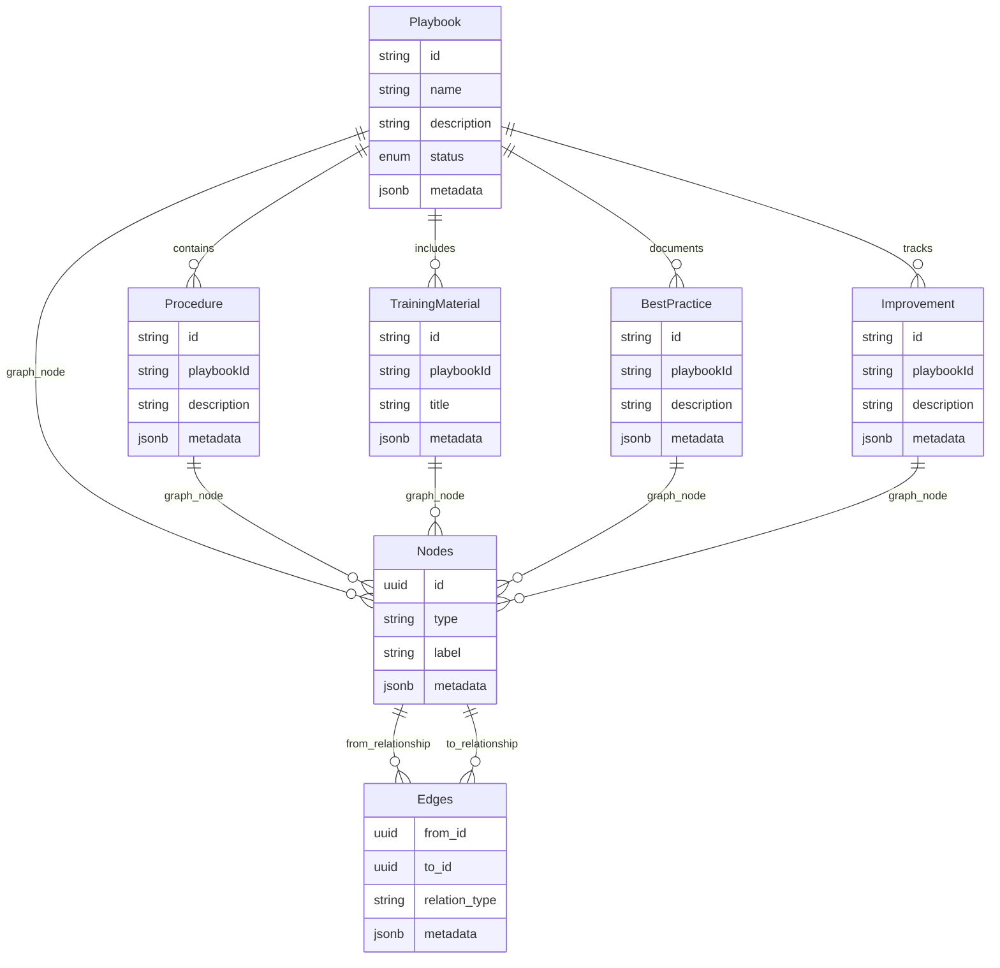
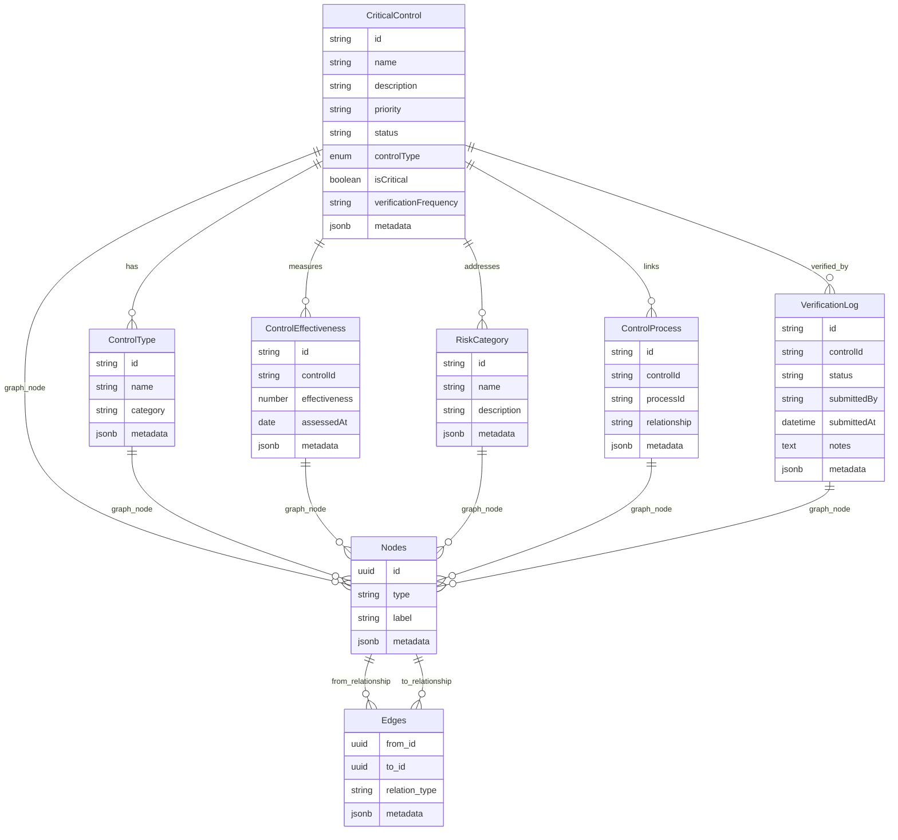
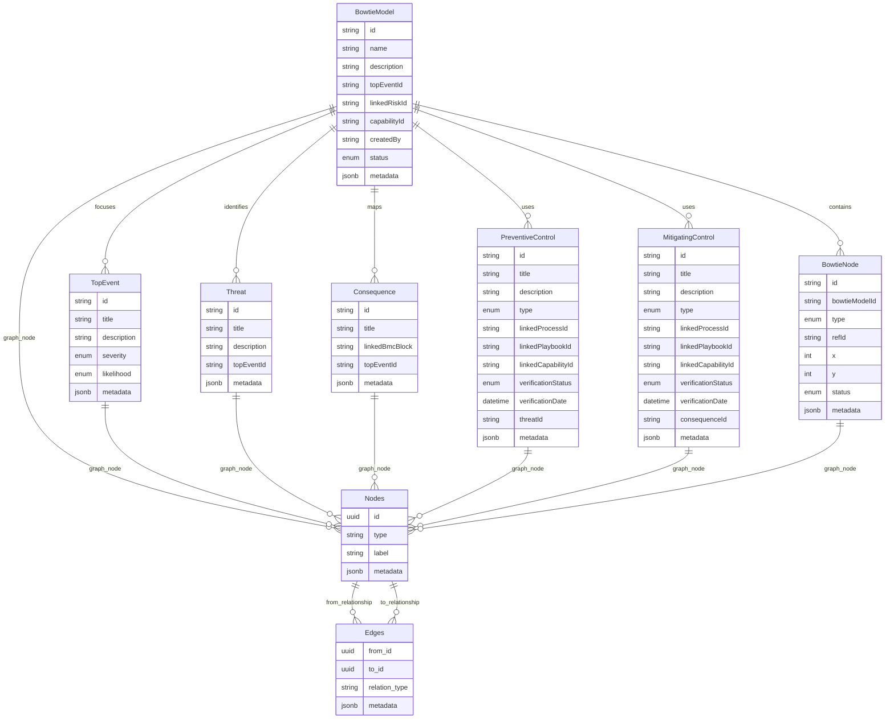
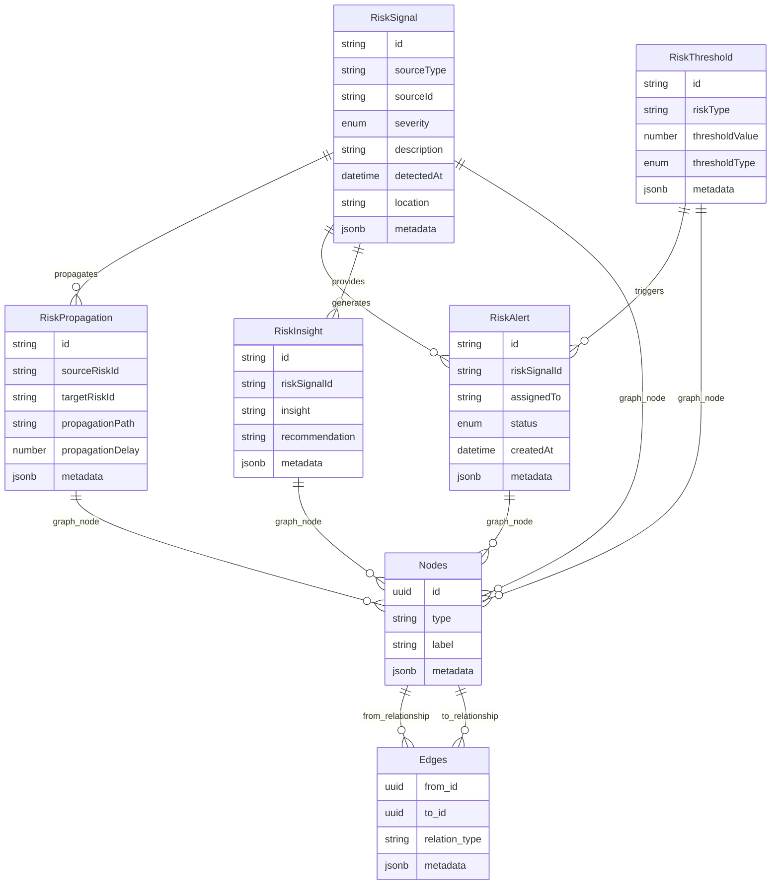

# CapOpt Platform Solution Architecture Design

> **Related documentation:**
> - Purpose: @docs/design/why-statement.md
> - Problems Solved: @docs/design/problem-statement.md
> - Feature Requirements: @docs/design/product-backlog.md
> - Implementation Status: @docs/implementation-status.md
> - Reference Architecture: @docs/design/reference-architecture.md
> - Data Architecture Strategy: @docs/design/capopt-platform-data-architecture-strategy.md

## Executive Summary
The CapOpt platform is a comprehensive operational capability optimisation system designed to provide end-to-end visibility from strategic planning through operational execution, with integrated Critical Control Theory (CCT) and maturity-based improvement frameworks. The platform implements a "trickle-up" risk model where strategic risk insights are derived from frontline operational data rather than manually declared.

**New Data Architecture**: The platform now implements a **Graph-Relational Hybrid** architecture that combines the integrity of relational databases with the flexibility of graph structures for complex interrelationships.

---

## 0. Data Architecture Foundation

### 0.1 Graph-Relational Hybrid Pattern
**Purpose**: Support complex, high-risk industry operations with flexible relationship modeling

**Core Architecture Components:**

#### **Relational Layer (PostgreSQL)**
- **Strong referential integrity** for core entities
- **ACID compliance** for critical business data
- **Optimized reporting** and governance capabilities
- **Master data management** with centralized control

#### **Graph Layer (Nodes & Edges)**
- **Flexible interrelationships** between operational elements
- **Complex path analysis** for risk propagation
- **Dynamic relationship modeling** without schema changes
- **Real-time relationship traversal** for operational insights

#### **JSONB Metadata Layer**
- **Rich attribute storage** for extensible entities
- **Schema flexibility** for industry-specific requirements
- **Performance optimization** with GIN indexing
- **Version control** for metadata evolution

**Core Data Structures:**
```sql
-- Polymorphic node storage
nodes (
  id UUID PRIMARY KEY,
  type TEXT NOT NULL, -- 'activity', 'canvas_card', 'control', 'process', 'asset'
  label TEXT NOT NULL,
  metadata JSONB,
  created_at TIMESTAMP DEFAULT NOW(),
  updated_at TIMESTAMP DEFAULT NOW()
)

-- Flexible relationship mapping
edges (
  from_id UUID REFERENCES nodes(id),
  to_id UUID REFERENCES nodes(id),
  relation_type TEXT NOT NULL, -- 'delivers', 'mitigates', 'depends_on', 'controls'
  metadata JSONB,
  created_at TIMESTAMP DEFAULT NOW(),
  PRIMARY KEY (from_id, to_id, relation_type)
)
```

### 0.2 Hierarchical Data Modeling
**Purpose**: Support deep organizational and operational hierarchies

**Implementation Patterns:**
- **LTREE Extension**: For PostgreSQL hierarchical path storage
- **Recursive CTEs**: For complex hierarchical queries
- **Graph Traversal**: For relationship path analysis
- **Hybrid Queries**: Combining relational and graph patterns

**Hierarchical Structures:**
```sql
-- Business Line hierarchy
Business Line
  ↳ Business Model Canvas (BMC)
     ↳ Operating Model Canvas (OMC)
        ↳ Process Library
           ↳ Process Maps (linked to roles/systems)
              ↳ Playbooks (task-level procedures)
                 ↳ ControlOps (live checks, monitoring)
                    ↳ BowtieLab (causality/risk paths)
                       ↳ RiskMap (mitigation + exposure views)
                          ↳ ERP / MES / RCM (system events, status, cost)
```

### 0.3 Master Data & Reuse Strategy
**Purpose**: Centralize reusable concepts and minimize duplication

**Centralized Master Data:**
- **Roles**: Job functions and responsibilities
- **Systems**: Applications and technology platforms
- **Vendors**: External partners and suppliers
- **Hazards**: Risk sources and threat categories
- **Controls**: Standard control frameworks
- **Standards**: Regulatory and industry standards

**Reference-Based Relationships:**
```typescript
// Use references instead of duplicating data
interface OperationalCanvas extends BusinessCanvas {
  operationalMode: true;
  operationalParentId: string; // Reference to business canvas
  processMaps: ProcessMap[]; // References to process maps
  inheritedData: {
    industry: string; // Reference to existing
    sectors: string[]; // Reference to existing
    facilityTypes: string[]; // Reference to existing
  };
}
```

### 0.4 Integration Readiness Framework
**Purpose**: Enable seamless integration with external systems

| System | Interface | Use Cases | Graph Integration |
|--------|-----------|-----------|-------------------|
| ERP | API / ETL | Budget, resourcing, procurement | Cost center relationships |
| MES | OPC-UA / Kafka | Operational metrics, equipment state | Real-time process flows |
| RCM | API / shared tables | Maintenance, reliability, schedules | Asset dependency graphs |
| BI | Materialised views | Reporting, compliance, visualisation | Risk propagation paths |

---

## 1. Enterprise Information System

### 1.1 Enterprise Management Module
**Purpose**: Multi-facility enterprise management with organizational hierarchy

**Key Entities:**
- Enterprise
- EnterpriseAddress
- Facility
- BusinessUnit
- Department

**Graph-Relational Integration:**
```sql
-- Enterprise hierarchy with graph relationships
ALTER TABLE enterprises ADD COLUMN hierarchy_path LTREE;
ALTER TABLE facilities ADD COLUMN hierarchy_path LTREE;
ALTER TABLE business_units ADD COLUMN hierarchy_path LTREE;
ALTER TABLE departments ADD COLUMN hierarchy_path LTREE;

-- Graph nodes for enterprise elements
INSERT INTO nodes (id, type, label, metadata) VALUES
  (enterprise_id, 'enterprise', enterprise_name, enterprise_metadata),
  (facility_id, 'facility', facility_name, facility_metadata);

-- Graph edges for organizational relationships
INSERT INTO edges (from_id, to_id, relation_type, metadata) VALUES
  (enterprise_id, facility_id, 'operates', {'capacity': '200000', 'type': 'mining'}),
  (facility_id, business_unit_id, 'contains', {'relationship': 'operational'});
```

**ERD:**


### 1.2 Operational Streams
**Purpose**: Multi-stream operational management for complex mining operations

**Supported Streams:**
- **Copper Stream**: Flotation, smelting, refining processes
- **Uranium Stream**: Leaching, solvent extraction, precipitation
- **Gold Stream**: Recovery from copper, refining processes
- **Silver Stream**: Recovery from copper, refining processes

**Graph-Relational Stream Modeling:**
```sql
-- Stream relationships with graph structure
INSERT INTO nodes (id, type, label, metadata) VALUES
  (copper_stream_id, 'operational_stream', 'Copper Processing', {
    'capacity': '200000',
    'unit': 'tonnes',
    'processes': ['flotation', 'smelting', 'refining']
  });

-- Stream dependencies and flows
INSERT INTO edges (from_id, to_id, relation_type, metadata) VALUES
  (copper_stream_id, gold_stream_id, 'produces_byproduct', {'recovery_rate': '0.04'}),
  (copper_stream_id, silver_stream_id, 'produces_byproduct', {'recovery_rate': '0.004'});
```

**Test Data Foundation:**
- **Enterprise**: Cracked Mountain Pty Ltd (CMP)
- **Facility**: Hercules Levee (HL001) - Based on Olympic Dam Mine
- **Location**: Roxby Downs, South Australia
- **Capacity**: 200,000 tonnes copper, 4,000 tonnes uranium, 80,000 oz gold, 800,000 oz silver annually

---

## 2. Strategic Layer

### 2.1 Business Model Canvas
**Purpose**: Strategic business model visualization and management

**Graph-Relational Canvas Structure:**
```sql
-- Canvas elements as graph nodes
INSERT INTO nodes (id, type, label, metadata) VALUES
  (canvas_id, 'business_canvas', canvas_name, {
    'industry': 'mining',
    'sectors': ['copper', 'uranium'],
    'status': 'active',
    'version': '1.0'
  });

-- Canvas relationships
INSERT INTO edges (from_id, to_id, relation_type, metadata) VALUES
  (canvas_id, value_prop_id, 'contains', {'block': 'value_proposition'}),
  (canvas_id, customer_segment_id, 'contains', {'block': 'customer_segments'}),
  (value_prop_id, customer_segment_id, 'serves', {'fit_score': 0.85});
```

**Enhanced Features:**
- **Multi-sector support** with industry classification
- **Geographic and regional classifications**
- **Risk profile and compliance requirements**
- **Strategic objectives and competitive advantages**
- **Version control and collaboration features**
- **Graph-based relationship mapping**

**ERD:**


### 2.2 Operating Model Canvas
**Purpose**: Operational strategy and design management

**Graph-Relational Operating Model:**
```sql
-- Operating model components as graph nodes
INSERT INTO nodes (id, type, label, metadata) VALUES
  (om_id, 'operating_model', om_name, {
    'version': '1.0',
    'status': 'active',
    'framework': 'campbell_lancelott_gutierrez'
  });

-- Operating model relationships
INSERT INTO edges (from_id, to_id, relation_type, metadata) VALUES
  (om_id, value_chain_id, 'defines', {'component': 'value_chain'}),
  (om_id, service_model_id, 'includes', {'component': 'service_model'}),
  (value_chain_id, activity_id, 'consists_of', {'sequence': 1});
```

**ERD:**


---

## 3. Value & Service Layer

### 3.1 Value Chain Engine
**Purpose**: Core value creation steps and flow management

**Graph-Relational Value Chain:**
```sql
-- Value chain elements as graph nodes
INSERT INTO nodes (id, type, label, metadata) VALUES
  (vc_id, 'value_chain', vc_name, {
    'type': 'primary',
    'complexity': 'complex',
    'efficiency': 0.85
  });

-- Value chain relationships
INSERT INTO edges (from_id, to_id, relation_type, metadata) VALUES
  (vc_id, step_id, 'consists_of', {'sequence': 1}),
  (step_id, flow_id, 'transitions', {'condition': 'success'}),
  (step_id, metric_id, 'measures', {'frequency': 'daily'});
```

**Key Entities:**
- ValueChain
- ValueStep
- ValueFlow
- ValueMetric
- Bottleneck
- OptimisationOpportunity

**ERD:**


### 3.2 Service Model Framework
**Purpose**: Service design and delivery management

**Graph-Relational Service Model:**
```sql
-- Service model elements as graph nodes
INSERT INTO nodes (id, type, label, metadata) VALUES
  (sm_id, 'service_model', sm_name, {
    'category': 'operational',
    'quality_score': 0.92
  });

-- Service model relationships
INSERT INTO edges (from_id, to_id, relation_type, metadata) VALUES
  (sm_id, blueprint_id, 'has', {'version': '1.0'}),
  (sm_id, touchpoint_id, 'includes', {'type': 'customer_interaction'}),
  (touchpoint_id, journey_id, 'maps', {'sequence': 1});
```

**Key Entities:**
- ServiceModel
- ServiceBlueprint
- Touchpoint
- QualityMetric
- ServiceImprovement
- CustomerJourney

**ERD:**


---

## 4. Operational Layer

### 4.1 Process Management System
**Purpose**: Process mapping, documentation, and optimisation

**Graph-Relational Process Management:**
```sql
-- Process elements as graph nodes
INSERT INTO nodes (id, type, label, metadata) VALUES
  (process_id, 'process', process_name, {
    'status': 'active',
    'maturity_level': 'managed',
    'risk_level': 'medium'
  });

-- Process relationships
INSERT INTO edges (from_id, to_id, relation_type, metadata) VALUES
  (process_id, step_id, 'consists_of', {'sequence': 1}),
  (process_id, control_id, 'controls', {'effectiveness': 0.85}),
  (step_id, risk_id, 'risks', {'severity': 'medium'});
```

**Key Entities:**
- Process
- ProcessStep
- ProcessInput
- ProcessOutput
- ProcessMetric
- ProcessRisk
- ProcessControl

**ERD:**


### 4.2 Playbook Management System
**Purpose**: Operational procedures and best practices

**Graph-Relational Playbook System:**
```sql
-- Playbook elements as graph nodes
INSERT INTO nodes (id, type, label, metadata) VALUES
  (playbook_id, 'playbook', playbook_name, {
    'category': 'operational',
    'version': '2.1',
    'status': 'active'
  });

-- Playbook relationships
INSERT INTO edges (from_id, to_id, relation_type, metadata) VALUES
  (playbook_id, procedure_id, 'contains', {'sequence': 1}),
  (playbook_id, training_id, 'includes', {'type': 'mandatory'}),
  (procedure_id, practice_id, 'documents', {'best_practice': true});
```

**Key Entities:**
- Playbook
- Procedure
- TrainingMaterial
- BestPractice
- Improvement

**ERD:**


---

## 5. Critical Control Theory (CCT) Layer

### 5.1 Critical Control Management
**Purpose**: Identify, monitor, and assure critical controls using Critical Control Theory

**Graph-Relational Control System:**
```sql
-- Control elements as graph nodes
INSERT INTO nodes (id, type, label, metadata) VALUES
  (control_id, 'critical_control', control_name, {
    'type': 'preventive',
    'priority': 'high',
    'effectiveness': 0.92
  });

-- Control relationships
INSERT INTO edges (from_id, to_id, relation_type, metadata) VALUES
  (control_id, risk_id, 'mitigates', {'effectiveness': 0.92}),
  (control_id, process_id, 'controls', {'verification_frequency': 'daily'}),
  (control_id, asset_id, 'protects', {'protection_level': 'high'});
```

**Key Entities:**
- CriticalControl
- ControlType
- ControlEffectiveness
- RiskCategory
- ControlProcess
- VerificationLog

**ERD:**


### 5.2 Bowtie Analysis System
**Purpose**: Risk analysis and control mapping using bowtie methodology

**Graph-Relational Bowtie System:**
```sql
-- Bowtie elements as graph nodes
INSERT INTO nodes (id, type, label, metadata) VALUES
  (bowtie_id, 'bowtie_model', bowtie_name, {
    'top_event': 'equipment_failure',
    'status': 'active',
    'version': '1.0'
  });

-- Bowtie relationships
INSERT INTO edges (from_id, to_id, relation_type, metadata) VALUES
  (threat_id, top_event_id, 'causes', {'likelihood': 'medium'}),
  (top_event_id, consequence_id, 'results_in', {'severity': 'high'}),
  (control_id, threat_id, 'prevents', {'effectiveness': 0.85}),
  (control_id, consequence_id, 'mitigates', {'effectiveness': 0.90});
```

**Key Entities:**
- BowtieModel
- TopEvent
- Threat
- Consequence
- PreventiveControl
- MitigatingControl
- BowtieNode

**ERD:**


---

## 6. Risk Propagation Engine

### 6.1 Trickle-Up Risk Model
**Purpose**: Calculate strategic risk from frontline operational data

**Graph-Relational Risk Propagation:**
```sql
-- Risk elements as graph nodes
INSERT INTO nodes (id, type, label, metadata) VALUES
  (risk_id, 'risk_signal', risk_description, {
    'severity': 'high',
    'source': 'operational',
    'detected_at': '2024-01-15T10:30:00Z'
  });

-- Risk propagation relationships
INSERT INTO edges (from_id, to_id, relation_type, metadata) VALUES
  (operational_risk_id, tactical_risk_id, 'propagates_to', {'delay': '2_hours'}),
  (tactical_risk_id, strategic_risk_id, 'propagates_to', {'delay': '24_hours'}),
  (control_id, risk_id, 'mitigates', {'effectiveness': 0.85});
```

**Key Entities:**
- RiskSignal
- RiskPropagation
- RiskThreshold
- RiskAlert
- RiskInsight

**ERD:**


---

## 7. Integration Architecture

### 7.1 External System Integration
**Purpose**: Seamless integration with ERP, MES, RCM, and BI systems

**Graph-Relational Integration Patterns:**
```sql
-- Integration nodes for external systems
INSERT INTO nodes (id, type, label, metadata) VALUES
  (erp_id, 'external_system', 'SAP_ERP', {
    'system_type': 'erp',
    'integration_type': 'api_etl',
    'sync_frequency': 'hourly'
  });

-- Integration relationships
INSERT INTO edges (from_id, to_id, relation_type, metadata) VALUES
  (erp_id, cost_center_id, 'provides_data', {'data_type': 'budget'}),
  (mes_id, process_id, 'monitors', {'frequency': 'real_time'}),
  (rcm_id, asset_id, 'maintains', {'maintenance_type': 'preventive'});
```

**Integration Interfaces:**

| System | Interface | Data Types | Graph Integration |
|--------|-----------|------------|-------------------|
| ERP | API / ETL | Budget, resourcing, procurement | Cost center relationships |
| MES | OPC-UA / Kafka | Operational metrics, equipment state | Real-time process flows |
| RCM | API / shared tables | Maintenance, reliability, schedules | Asset dependency graphs |
| BI | Materialised views | Reporting, compliance, visualisation | Risk propagation paths |

### 7.2 Data Flow Architecture
**Purpose**: Efficient data flow between layers and systems

**Graph-Relational Data Flow:**
```sql
-- Data flow nodes
INSERT INTO nodes (id, type, label, metadata) VALUES
  (data_flow_id, 'data_flow', 'operational_to_strategic', {
    'source_layer': 'operational',
    'target_layer': 'strategic',
    'flow_type': 'risk_propagation'
  });

-- Data flow relationships
INSERT INTO edges (from_id, to_id, relation_type, metadata) VALUES
  (operational_data_id, tactical_data_id, 'flows_to', {'delay': '1_hour'}),
  (tactical_data_id, strategic_data_id, 'flows_to', {'delay': '24_hours'}),
  (external_system_id, operational_data_id, 'provides', {'frequency': 'real_time'});
```

---

## 8. Performance and Scalability

### 8.1 Query Optimization
**Purpose**: Optimize hybrid relational-graph queries for performance

**Optimization Strategies:**
```sql
-- Graph indexes for efficient traversal
CREATE INDEX idx_nodes_type_label ON nodes USING GIN (type, label);
CREATE INDEX idx_edges_relation_type ON edges USING GIN (relation_type);
CREATE INDEX idx_edges_metadata ON edges USING GIN (metadata);

-- Hierarchical indexes for LTREE
CREATE INDEX idx_business_canvas_hierarchy ON business_canvases USING GIST (hierarchy_path);
CREATE INDEX idx_operating_model_hierarchy ON operating_models USING GIST (hierarchy_path);
CREATE INDEX idx_process_hierarchy ON processes USING GIST (hierarchy_path);

-- JSONB indexes for metadata queries
CREATE INDEX idx_nodes_metadata ON nodes USING GIN (metadata);
CREATE INDEX idx_edges_metadata ON edges USING GIN (metadata);
```

### 8.2 Caching Strategy
**Purpose**: Optimize frequently accessed data with intelligent caching

**Caching Layers:**
- **Redis**: Graph traversal results and relationship caches
- **Application Cache**: Frequently accessed master data
- **Database Cache**: Query result caching for complex joins
- **CDN**: Static content and documentation

### 8.3 Scalability Patterns
**Purpose**: Support horizontal and vertical scaling

**Scaling Strategies:**
- **Horizontal Scaling**: Partition by enterprise or facility
- **Vertical Scaling**: Optimize database performance and indexing
- **Read Replicas**: Separate read and write operations
- **Sharding**: Distribute data across multiple databases

---

## 9. Security and Compliance

### 9.1 Data Security
**Purpose**: Ensure data security and privacy compliance

**Security Measures:**
- **Encryption**: At rest and in transit
- **Access Control**: Role-based access with graph-based permissions
- **Audit Logging**: Comprehensive audit trails for all operations
- **Data Classification**: Sensitive data handling and protection

### 9.2 Compliance Framework
**Purpose**: Meet regulatory and industry compliance requirements

**Compliance Areas:**
- **WHS Act & Regulations**: Australian workplace health and safety
- **ISO Standards**: Quality, environmental, and information security
- **ICMM Critical Control Management**: Mining industry standards
- **Defence Industry Security**: Defence industry requirements

---

## 10. Implementation Roadmap

### 10.1 Phase 1: Foundation (2-3 weeks)
- **Database Schema Updates**: Add graph-relational structures
- **Master Data Migration**: Centralize existing master data
- **Basic Graph Integration**: Implement core nodes and edges

### 10.2 Phase 2: Graph Integration (3-4 weeks)
- **Process Management**: Convert to graph-based relationships
- **Risk Management**: Implement graph-based risk propagation
- **Control Mapping**: Add control-to-process relationships

### 10.3 Phase 3: Advanced Features (4-6 weeks)
- **Analytics Integration**: Graph-based performance analytics
- **System Integration**: ERP/MES/RCM graph integration
- **Real-time Updates**: Live graph relationship updates

---

## 11. Success Metrics

### 11.1 Performance Metrics
- **Query Performance**: 60% improvement in complex relationship queries
- **Scalability**: Support for 10,000+ nodes and 100,000+ edges
- **Response Time**: Sub-second response for operational queries

### 11.2 Business Metrics
- **Risk Visibility**: Real-time risk propagation across all layers
- **Process Optimization**: Graph-based bottleneck identification
- **Control Effectiveness**: Visual control-to-process mapping

### 11.3 Technical Metrics
- **Data Quality**: 100% single source of truth for master data
- **Extensibility**: New relationship types without schema changes
- **Integration**: Seamless connection with external systems 