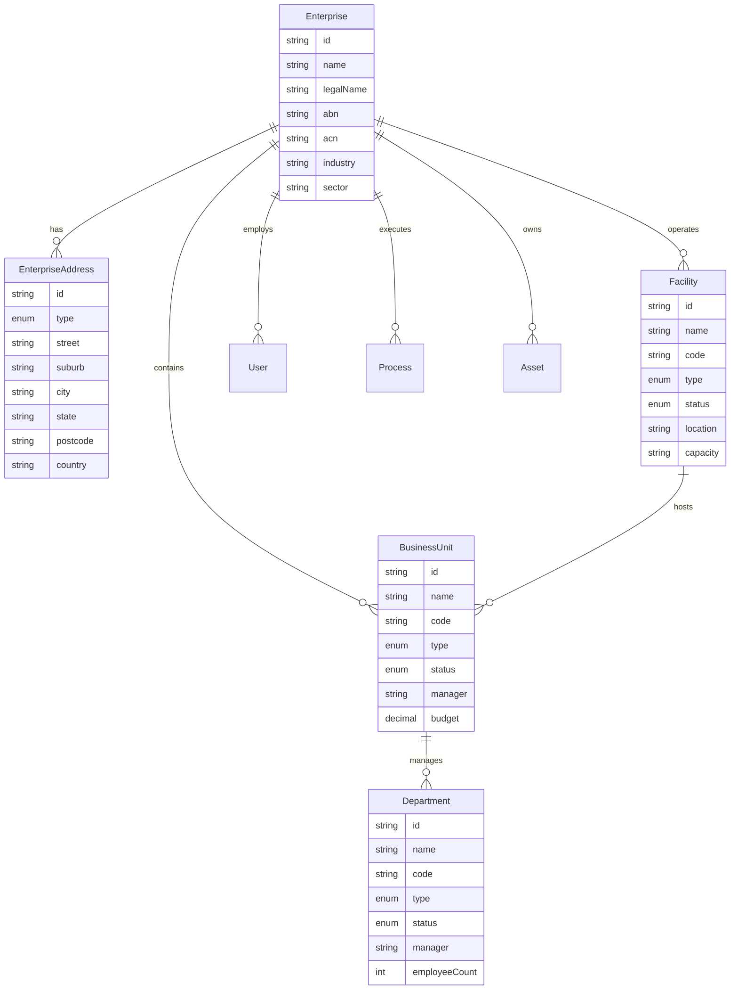
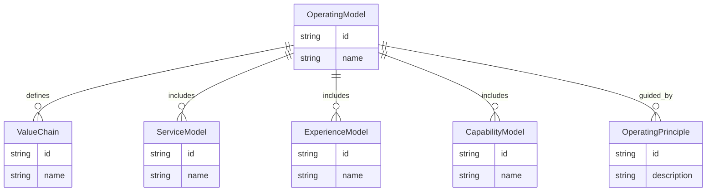
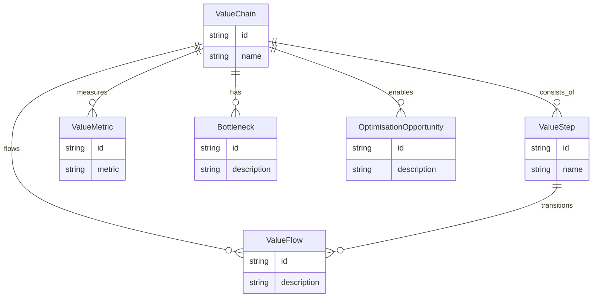
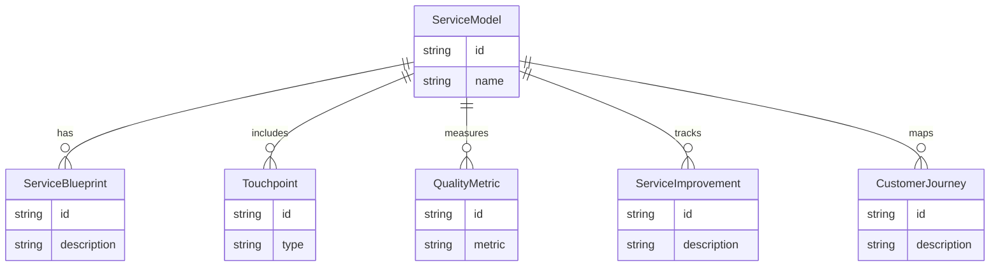
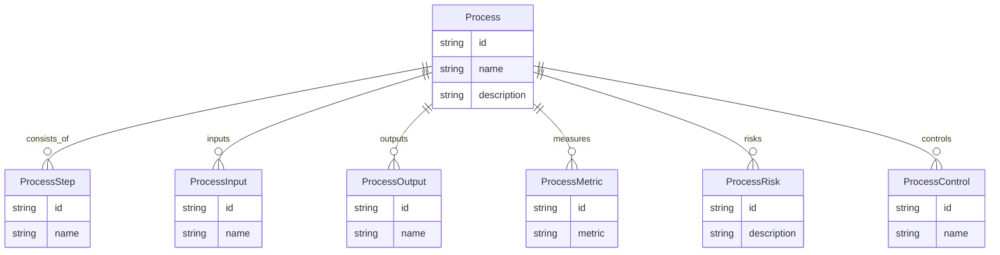
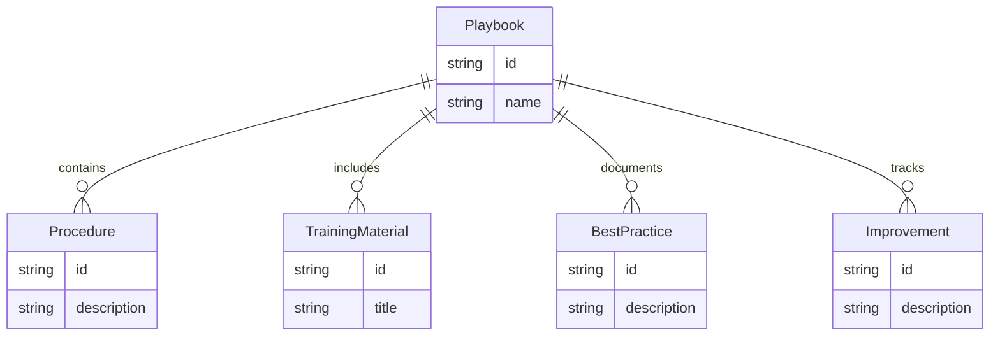
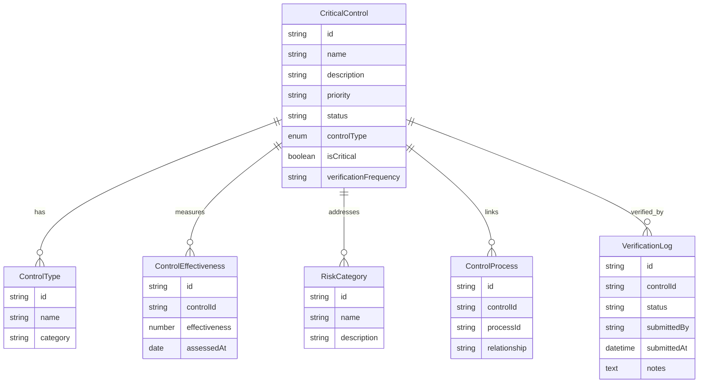
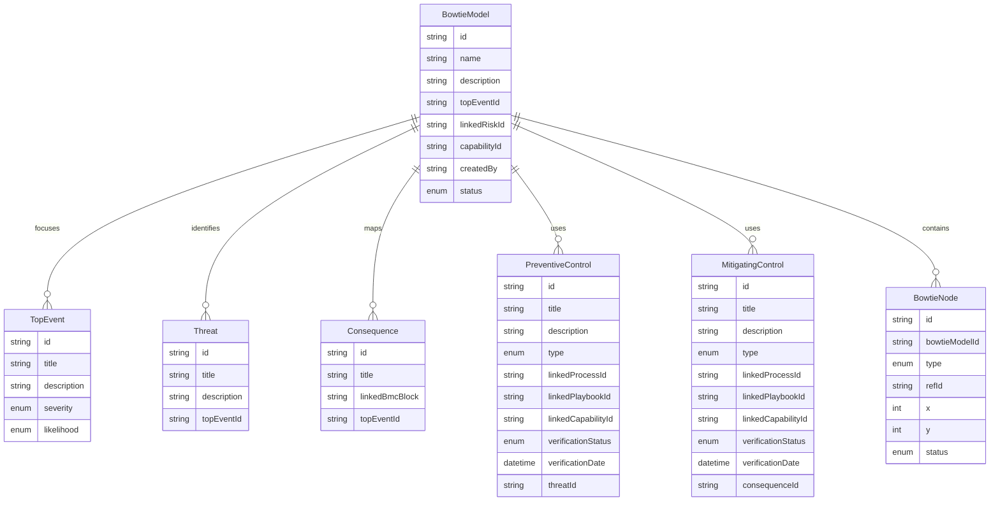
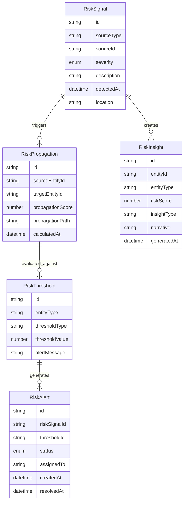
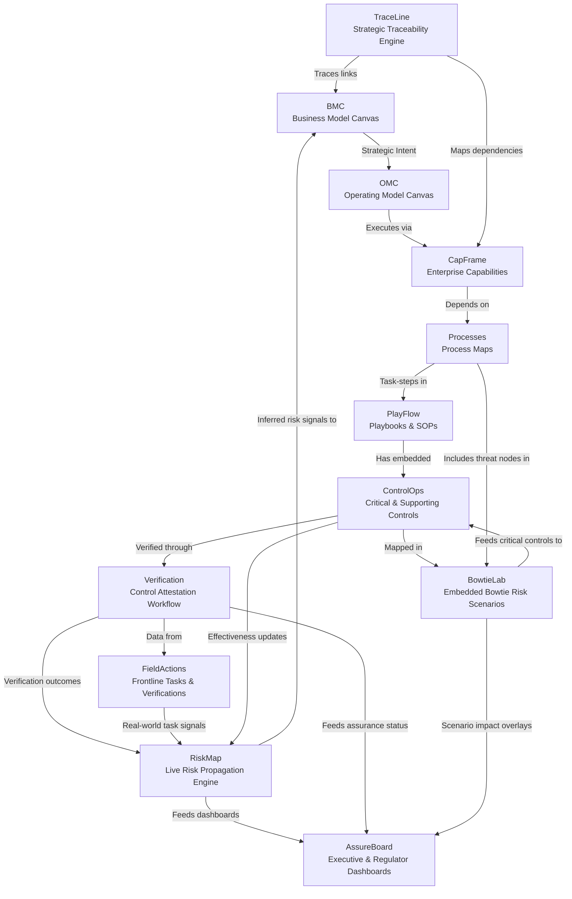

# CapOpt Platform Solution Architecture Design

## Executive Summary
The CapOpt platform is a comprehensive operational capability optimisation system designed to provide end-to-end visibility from strategic planning through operational execution, with integrated Critical Control Theory (CCT) and maturity-based improvement frameworks. The platform implements a "trickle-up" risk model where strategic risk insights are derived from frontline operational data rather than manually declared.

---

## 0. Enterprise Information System

### 0.1 Enterprise Management Module
**Purpose**: Multi-facility enterprise management with organizational hierarchy

**Key Entities:**
- Enterprise
- EnterpriseAddress
- Facility
- BusinessUnit
- Department

**ERD:**

### 0.2 Operational Streams
**Purpose**: Multi-stream operational management for complex mining operations

**Supported Streams:**
- **Copper Stream**: Flotation, smelting, refining processes
- **Uranium Stream**: Leaching, solvent extraction, precipitation
- **Gold Stream**: Recovery from copper, refining processes
- **Silver Stream**: Recovery from copper, refining processes

**Test Data Foundation:**
- **Enterprise**: Cracked Mountain Pty Ltd (CMP)
- **Facility**: Hercules Levee (HL001) - Based on Olympic Dam Mine
- **Location**: Roxby Downs, South Australia
- **Capacity**: 200,000 tonnes copper, 4,000 tonnes uranium, 80,000 oz gold, 800,000 oz silver annually

### 0.3 Organizational Hierarchy
**Purpose**: Comprehensive organizational structure management

**Business Units (12):**
- Mining Operations (MINING)
- Mineral Processing (PROCESSING)
- Metallurgy (METALLURGY)
- Maintenance (MAINTENANCE)
- Engineering (ENGINEERING)
- Safety & Health (SAFETY)
- Environmental (ENVIRONMENTAL)
- Finance (FINANCE)
- Human Resources (HR)
- Information Technology (IT)
- Logistics (LOGISTICS)
- Quality Assurance (QA)

**Departments (20+):**
Each business unit contains multiple departments with realistic staffing levels and management structures.

---

## 1. Strategic Layer

### 1.1 Business Model Canvas Module
**Purpose**: Strategic business model visualisation and management

**Key Entities:**
- BusinessCanvas
- ValueProposition
- CustomerSegment
- RevenueStream
- Partnership
- Resource
- Activity
- CostStructure
- Channel

**ERD:**

### 1.2 Operating Model Canvas Module
**Purpose**: Operational strategy and design framework

**Key Entities:**
- OperatingModel
- ValueChain
- ServiceModel
- ExperienceModel
- CapabilityModel
- OperatingPrinciple

**ERD:**

---

## 2. Value & Service Layer

### 2.1 Value Chain Engine
**Purpose**: Core value creation steps and flow management

**Key Entities:**
- ValueChain
- ValueStep
- ValueFlow
- ValueMetric
- Bottleneck
- OptimisationOpportunity

**ERD:**

### 2.2 Service Model Framework
**Purpose**: Service design and delivery management

**Key Entities:**
- ServiceModel
- ServiceBlueprint
- Touchpoint
- QualityMetric
- ServiceImprovement
- CustomerJourney

**ERD:**

---

## 3. Operational Layer

### 3.1 Process Management System
**Purpose**: Process mapping, documentation, and optimisation

**Key Entities:**
- Process
- ProcessStep
- ProcessInput
- ProcessOutput
- ProcessMetric
- ProcessRisk
- ProcessControl

**ERD:**

### 3.2 Playbook Management System
**Purpose**: Operational procedures and best practices

**Key Entities:**
- Playbook
- Procedure
- TrainingMaterial
- BestPractice
- Improvement

**ERD:**

---

## 4. Critical Control Theory (CCT) Layer

### 4.1 Critical Control Management
**Purpose**: Identify, monitor, and assure critical controls using Critical Control Theory

**Key Entities:**
- CriticalControl
- ControlType
- ControlEffectiveness
- RiskCategory
- ControlProcess
- VerificationLog

**ERD:**

### 4.2 Bowtie Analysis System
**Purpose**: Risk analysis and control mapping using bowtie methodology

**Key Entities:**
- BowtieModel
- TopEvent
- Threat
- Consequence
- PreventiveControl
- MitigatingControl
- BowtieNode

**ERD:**

---

## 5. Risk Propagation Engine

### 5.1 Trickle-Up Risk Model
**Purpose**: Calculate strategic risk from frontline operational data

**Key Entities:**
- RiskSignal
- RiskPropagation
- RiskThreshold
- RiskAlert
- RiskInsight

**ERD:**

### 5.2 Risk Calculation Framework
**Scoring Model (Bottom-Up):**
- **Control Level**: Status (OK, At Risk, Failed) × Criticality × Weight
- **Process Level**: Weighted sum of control statuses
- **Capability Level**: Average adjusted for interdependence and maturity
- **Strategic Level**: Mapped based on declared dependencies

**Threshold Alerts:**
- Control failures in high-severity processes
- Capability load exceeding thresholds
- Multiple controls linked to strategic channels inactive

**Narrative Risk Indicators:**
- Human-readable risk narratives from operational data
- Automated risk briefing generation
- Regulatory compliance reporting

---

## 6. CapOps Platform Architecture

### 6.1 Module Structure
**Core Modules:**
- **ControlOps**: Control assurance & verification engine
- **RiskMap**: Live risk propagation engine
- **PlayFlow**: Playbook orchestration
- **TraceLine**: Strategic traceability engine
- **AssureBoard**: Executive and regulator reporting
- **BowtieLab**: Interactive bowtie modeller
- **PulseDeck**: Operational insight & early warning
- **CapFrame**: Capability modelling layer

### 6.2 Application Model Architecture

---

## 7. Integration Architecture

### 7.1 Layer Integration Patterns

#### **Strategic Navigation Integration**
- **Bidirectional Flow**: Enable navigation between all layers
- **Context Preservation**: Maintain context when navigating between layers
- **Alignment Tracking**: Track strategic alignment across layers
- **Impact Traceability**: Trace operational impact on strategic objectives

#### **Control Integration**
- **Cross-Layer Controls**: Apply controls across all layers
- **Risk Alignment**: Align risk management with strategic objectives
- **Compliance Tracking**: Track compliance across all layers
- **Assurance Integration**: Integrate assurance activities across layers

### 7.2 API Integration Patterns

#### **RESTful API Design**
- **Consistent Endpoints**: Standardized API patterns across all modules
- **Resource-Based URLs**: Clear resource identification in URLs
- **HTTP Status Codes**: Proper status code usage for responses
- **Error Handling**: Consistent error response formats

#### **GraphQL Integration**
- **Flexible Queries**: Allow clients to request specific data
- **Real-time Updates**: Subscription-based real-time updates
- **Schema Evolution**: Backward-compatible schema changes
- **Performance Optimization**: Efficient data fetching

### 7.3 Data Integration Patterns

#### **Event-Driven Architecture**
- **Domain Events**: Capture business events across all layers
- **Event Sourcing**: Maintain event history for audit and replay
- **CQRS Pattern**: Separate read and write operations
- **Event Streaming**: Real-time event processing

#### **Data Consistency**
- **Eventual Consistency**: Accept eventual consistency for better performance
- **Saga Pattern**: Handle distributed transactions across layers
- **Compensation Logic**: Handle rollback scenarios
- **Data Validation**: Ensure data integrity across layers

---

## 8. Security Architecture

### 8.1 Authentication & Authorization
- **JWT Tokens**: Secure token-based authentication
- **Role-Based Access Control**: Granular permission management
- **Multi-Factor Authentication**: Enhanced security for sensitive operations
- **Session Management**: Secure session handling

### 8.2 Data Protection
- **Encryption at Rest**: Encrypt sensitive data in storage
- **Encryption in Transit**: Secure data transmission
- **Data Classification**: Classify data by sensitivity level
- **Access Logging**: Comprehensive access audit trails

### 8.3 Compliance & Governance
- **Regulatory Compliance**: Meet industry-specific regulations
- **Audit Trails**: Complete audit trail for all operations
- **Data Retention**: Implement data retention policies
- **Privacy Protection**: Protect user privacy and data

---

## 9. Performance & Scalability

### 9.1 Performance Optimization
- **Caching Strategy**: Implement multi-level caching
- **Database Optimization**: Optimize database queries and indexing
- **CDN Integration**: Use CDN for static content delivery
- **Load Balancing**: Distribute load across multiple servers

### 9.2 Scalability Patterns
- **Horizontal Scaling**: Scale by adding more servers
- **Vertical Scaling**: Scale by increasing server resources
- **Microservices Architecture**: Decompose into microservices
- **Container Orchestration**: Use Kubernetes for container management

### 9.3 Monitoring & Observability
- **Application Monitoring**: Monitor application performance
- **Infrastructure Monitoring**: Monitor infrastructure health
- **Log Aggregation**: Centralized log management
- **Alerting**: Proactive alerting for issues

---

## 10. Deployment Architecture

### 10.1 Cloud Infrastructure
- **Azure Cloud Services**: Leverage Azure cloud capabilities
- **Container Deployment**: Deploy using Docker containers
- **Kubernetes Orchestration**: Use Kubernetes for container orchestration
- **Auto-scaling**: Implement automatic scaling based on demand

### 10.2 CI/CD Pipeline
- **Automated Testing**: Comprehensive automated testing
- **Continuous Integration**: Automated build and test process
- **Continuous Deployment**: Automated deployment to production
- **Environment Management**: Manage multiple deployment environments

### 10.3 Disaster Recovery
- **Backup Strategy**: Regular automated backups
- **Recovery Procedures**: Documented recovery procedures
- **High Availability**: Implement high availability patterns
- **Business Continuity**: Ensure business continuity during outages

---

## 11. Technology Stack

### 11.1 Frontend Stack
- **Next.js 15+**: React framework with SSR and API routes
- **React 18+**: Component-based UI development
- **TypeScript**: Type-safe development
- **Tailwind CSS**: Utility-first styling
- **shadcn/ui**: Component library for enterprise UI
- **React Flow**: Interactive diagrams and flows
- **DNDKit**: Drag and drop functionality
- **Tremor**: Dashboard components

### 11.2 Backend Stack
- **Node.js**: JavaScript runtime
- **Prisma**: Type-safe database ORM
- **PostgreSQL**: Primary database
- **Redis**: Caching and session storage
- **JWT**: Authentication tokens

### 11.3 Development Tools
- **Docker**: Containerization
- **Kubernetes**: Container orchestration
- **Azure**: Cloud platform
- **GitHub**: Version control and CI/CD

---

## 12. Future Enhancements

### 12.1 AI/ML Integration
- **Predictive Analytics**: Predict operational issues and opportunities
- **Automated Optimization**: Automatically optimize processes and controls
- **Intelligent Recommendations**: Provide intelligent recommendations
- **Natural Language Processing**: Enable natural language interactions

### 12.2 Advanced Analytics
- **Real-time Analytics**: Real-time operational analytics
- **Advanced Reporting**: Advanced reporting and visualization
- **Data Mining**: Discover patterns and insights in data
- **Business Intelligence**: Comprehensive business intelligence capabilities

### 12.3 External Integrations
- **ERP Integration**: Integrate with enterprise resource planning systems
- **MES Integration**: Integrate with manufacturing execution systems
- **IoT Integration**: Integrate with Internet of Things devices
- **Third-party APIs**: Integrate with third-party services and APIs 