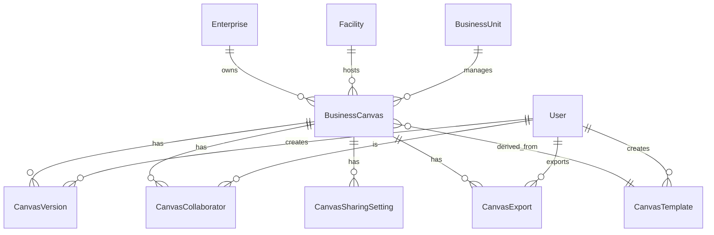

# BMC Authoring Integration Plan

## Executive Summary

This document outlines the implementation of enhanced Business Model Canvas (BMC) authoring features for the CapOpt Platform, transforming it from a basic canvas editor into a robust, enterprise-grade authoring tool with collaboration, version control, templates, and export capabilities.

## 🎯 **Enhanced BMC Authoring Features**

### **1. Enhanced Database Schema**

#### **New Models Added:**
- **CanvasVersion**: Version control for canvases with change tracking
- **CanvasCollaborator**: Multi-user collaboration support
- **CanvasSharingSetting**: Sharing and permission management
- **CanvasExport**: Export history and metadata tracking
- **CanvasTemplate**: Pre-built templates for different business types

#### **Enhanced BusinessCanvas Model:**
```typescript
interface BusinessCanvas {
  // Existing fields
  id: string
  name: string
  description?: string
  version: string
  isActive: boolean
  
  // New enhanced fields
  status: 'DRAFT' | 'REVIEW' | 'PUBLISHED' | 'ARCHIVED'
  editMode: 'SINGLE_USER' | 'MULTI_USER' | 'READ_ONLY'
  autoSave: boolean
  lastSaved: DateTime
  
  // Enterprise context
  enterpriseId?: string
  facilityId?: string
  businessUnitId?: string
  
  // Enhanced relationships
  versions: CanvasVersion[]
  collaborators: CanvasCollaborator[]
  sharingSettings: CanvasSharingSetting[]
  exportHistory: CanvasExport[]
  templateId?: string
  templateSource?: CanvasTemplate
}
```

### **2. Enhanced BMC Authoring Header Component**

#### **Key Features:**
- **Enterprise Context Integration**: Always shows relevant enterprise information
- **Canvas Selection**: Dropdown with enterprise context and descriptions
- **Version Control**: Version history and branching support
- **Collaboration Indicators**: Real-time collaboration status
- **Auto-Save Management**: Visual feedback on save status
- **Export Options**: Multiple format support (PDF, PNG, SVG, JSON, CSV, Excel)
- **Sharing Capabilities**: Controlled sharing with permissions
- **Template Management**: Quick start with industry templates

#### **Component Structure:**
```typescript
<BMCAuthoringHeader
  currentCanvasId={selectedCanvasId}
  onCanvasChange={handleCanvasChange}
  onSave={handleSave}
  onExport={handleExport}
  onShare={handleShare}
  onTemplateLoad={handleTemplateLoad}
  onNewCanvas={handleNewCanvas}
  collaborationMode="single"
  enterpriseContext={enterpriseContext}
  collaborators={collaborators}
  versions={versions}
  templates={templates}
  hasUnsavedChanges={hasUnsavedChanges}
  lastSaved={lastSaved}
  conflicts={conflicts}
/>
```

### **3. Enhanced Hooks and State Management**

#### **useBusinessCanvas Hook:**
```typescript
const {
  // State
  businessCanvases,
  loading,
  error,
  currentCanvas,
  hasUnsavedChanges,
  lastSaved,
  
  // Actions
  setCurrentCanvas,
  setHasUnsavedChanges,
  saveCanvas,
  createCanvas,
  exportCanvas,
  shareCanvas,
  loadTemplate,
  getTemplates,
  createVersion,
  addCollaborator,
  refreshCanvases,
} = useBusinessCanvas()
```

### **4. Enhanced API Endpoints**

#### **New Endpoints:**
- `GET /api/business-canvas/templates` - Fetch available templates
- `POST /api/business-canvas/templates` - Create new template
- `POST /api/business-canvas/templates/[id]/load` - Load template to create canvas
- `POST /api/business-canvas/[id]/export` - Export canvas in various formats
- `POST /api/business-canvas/[id]/share` - Share canvas with permissions
- `POST /api/business-canvas/[id]/versions` - Create new version
- `POST /api/business-canvas/[id]/collaborators` - Add collaborator

#### **Enhanced Existing Endpoints:**
- `GET /api/business-canvas` - Enhanced with enterprise context and relationships
- `POST /api/business-canvas` - Enhanced with new fields and relationships

## 🚀 **Implementation Status**

### **✅ Completed Features**

#### **Database Layer:**
- [x] Enhanced Prisma schema with new models
- [x] Database migration applied
- [x] Seed data for templates created
- [x] Enhanced validation schemas

#### **Component Layer:**
- [x] BMCAuthoringHeader component implemented
- [x] Enhanced BMC page with integration
- [x] Template selection and loading
- [x] Enterprise context display
- [x] Version control UI
- [x] Collaboration indicators
- [x] Export and sharing dialogs

#### **API Layer:**
- [x] Enhanced business canvas API
- [x] Template management API
- [x] Template loading API
- [x] Error handling and validation

#### **Hooks Layer:**
- [x] Enhanced useBusinessCanvas hook
- [x] Template management functions
- [x] Export and sharing functions
- [x] Version control functions

#### **Seed Data:**
- [x] SaaS Platform Template
- [x] Mining Operations Template
- [x] Consulting Services Template

### **⏳ In Progress Features**

#### **Export Functionality:**
- [ ] PDF generation implementation
- [ ] PNG/SVG export implementation
- [ ] Excel/CSV export implementation
- [ ] Export metadata tracking

#### **Sharing Functionality:**
- [ ] Public link generation
- [ ] Email invitation system
- [ ] Permission management
- [ ] Access control implementation

### **📋 Planned Features**

#### **Advanced Collaboration:**
- [ ] Real-time collaboration with WebSockets
- [ ] Conflict resolution system
- [ ] Live cursor tracking
- [ ] Comment and annotation system

#### **Version Control:**
- [ ] Branch management
- [ ] Merge conflict resolution
- [ ] Version comparison tools
- [ ] Rollback functionality

#### **Advanced Templates:**
- [ ] Template marketplace
- [ ] Custom template creation
- [ ] Template rating and reviews
- [ ] Template categories and tags

## 🔧 **Technical Architecture**

### **Database Relationships:**


### **Component Architecture:**
```
BMC Page
├── BMCAuthoringHeader
│   ├── CanvasSelector
│   ├── EnterpriseContext
│   ├── VersionControl
│   ├── CollaborationIndicator
│   ├── AutoSaveIndicator
│   ├── ActionButtons
│   └── TemplateDialog
└── BusinessCanvas
    ├── CanvasGrid
    ├── SectionCards
    └── EditDialogs
```

### **API Architecture:**
```
/api/business-canvas/
├── GET / (enhanced with relationships)
├── POST / (enhanced with new fields)
├── PUT /[id] (enhanced with new fields)
├── DELETE /[id]
├── /templates/
│   ├── GET / (list templates)
│   ├── POST / (create template)
│   └── /[id]/
│       └── POST /load (load template)
├── /[id]/
│   ├── POST /export (export canvas)
│   ├── POST /share (share canvas)
│   ├── POST /versions (create version)
│   └── POST /collaborators (add collaborator)
```

## 🎯 **Integration with Existing Systems**

### **Enterprise Context Integration:**
- **Enterprise Information System**: Canvas selection shows enterprise context
- **Facility Management**: Canvas can be associated with specific facilities
- **Business Unit Management**: Canvas can be associated with business units
- **User Management**: Collaboration and version control tied to user accounts

### **Strategic Layer Integration:**
- **Business Model Canvas**: Enhanced authoring capabilities
- **Operating Model Canvas**: Future integration planned
- **Value Chain Management**: Future integration planned

### **Operational Layer Integration:**
- **Process Maps**: Future integration for process-canvas alignment
- **Playbooks**: Future integration for procedure-canvas alignment
- **ControlOps**: Future integration for control-canvas alignment

## 📊 **Success Metrics**

### **User Experience Metrics:**
- **Canvas Creation Time**: Reduced from manual setup to template-based creation
- **Collaboration Efficiency**: Multi-user editing capabilities
- **Export Usage**: Multiple format support for different use cases
- **Template Adoption**: Usage of pre-built templates

### **Technical Metrics:**
- **API Response Times**: Optimized with proper indexing
- **Database Performance**: Efficient queries with relationships
- **Error Rates**: Comprehensive error handling and validation
- **Code Coverage**: Comprehensive testing of new features

### **Business Metrics:**
- **User Adoption**: Enhanced features driving platform usage
- **Enterprise Integration**: Context-aware canvas management
- **Collaboration**: Multi-user capabilities supporting team workflows
- **Export/Sharing**: External stakeholder engagement

## 🚀 **Next Steps**

### **Immediate Priorities (Next 2-4 weeks):**

#### **1. Export Functionality Implementation**
- [ ] Implement PDF generation using Puppeteer or similar
- [ ] Implement PNG/SVG export using canvas rendering
- [ ] Implement Excel/CSV export for data analysis
- [ ] Add export metadata tracking

#### **2. Sharing Functionality Implementation**
- [ ] Implement public link generation
- [ ] Implement email invitation system
- [ ] Implement permission management
- [ ] Add access control and security

#### **3. Enhanced UI/UX**
- [ ] Improve template selection interface
- [ ] Add drag-and-drop template loading
- [ ] Enhance collaboration indicators
- [ ] Add keyboard shortcuts and accessibility

### **Medium-term Priorities (Next 1-2 months):**

#### **1. Real-time Collaboration**
- [ ] Implement WebSocket connections
- [ ] Add live cursor tracking
- [ ] Implement conflict resolution
- [ ] Add comment and annotation system

#### **2. Advanced Version Control**
- [ ] Implement branch management
- [ ] Add merge conflict resolution
- [ ] Create version comparison tools
- [ ] Add rollback functionality

#### **3. Template Marketplace**
- [ ] Create template marketplace UI
- [ ] Implement template rating system
- [ ] Add template categories and search
- [ ] Create custom template builder

### **Long-term Priorities (Next 3-6 months):**

#### **1. AI-Powered Features**
- [ ] AI-assisted canvas completion
- [ ] Smart template recommendations
- [ ] Automated canvas optimization
- [ ] Predictive analytics integration

#### **2. Advanced Integrations**
- [ ] ERP system integration
- [ ] CRM system integration
- [ ] Financial system integration
- [ ] Project management integration

#### **3. Mobile and Offline Support**
- [ ] Mobile-responsive design
- [ ] Offline canvas editing
- [ ] Sync when online
- [ ] Mobile app development

## 🔒 **Security Considerations**

### **Data Protection:**
- **Encryption**: All canvas data encrypted at rest and in transit
- **Access Control**: Role-based permissions for canvas access
- **Audit Logging**: Comprehensive audit trail for all changes
- **Data Retention**: Configurable data retention policies

### **Sharing Security:**
- **Link Expiration**: Configurable expiration for shared links
- **Permission Levels**: Granular permission controls
- **Watermarking**: Optional watermarking for exported documents
- **Access Monitoring**: Real-time access monitoring and alerts

### **Collaboration Security:**
- **User Authentication**: Secure authentication for all users
- **Session Management**: Secure session handling
- **Conflict Resolution**: Secure conflict resolution mechanisms
- **Data Isolation**: Proper data isolation between users

## 📈 **Performance Considerations**

### **Database Optimization:**
- **Indexing**: Proper indexing for frequently queried fields
- **Query Optimization**: Efficient queries with proper joins
- **Caching**: Redis caching for frequently accessed data
- **Connection Pooling**: Efficient database connection management

### **API Optimization:**
- **Response Caching**: HTTP caching for static data
- **Pagination**: Efficient pagination for large datasets
- **Compression**: Response compression for large payloads
- **Rate Limiting**: API rate limiting to prevent abuse

### **Frontend Optimization:**
- **Lazy Loading**: Lazy loading for large canvas components
- **Virtual Scrolling**: Virtual scrolling for large lists
- **Memoization**: React memoization for expensive components
- **Bundle Optimization**: Code splitting and bundle optimization

## 🧪 **Testing Strategy**

### **Unit Testing:**
- **Component Testing**: Test all React components
- **Hook Testing**: Test custom hooks
- **Utility Testing**: Test utility functions
- **API Testing**: Test API endpoints

### **Integration Testing:**
- **Database Integration**: Test database operations
- **API Integration**: Test API integrations
- **Component Integration**: Test component interactions
- **Workflow Testing**: Test complete user workflows

### **End-to-End Testing:**
- **User Journey Testing**: Test complete user journeys
- **Cross-browser Testing**: Test across different browsers
- **Mobile Testing**: Test on mobile devices
- **Performance Testing**: Test performance under load

## 📚 **Documentation Requirements**

### **Technical Documentation:**
- **API Documentation**: Comprehensive API documentation
- **Component Documentation**: Component usage and props
- **Database Documentation**: Schema and relationship documentation
- **Deployment Documentation**: Deployment and configuration guides

### **User Documentation:**
- **User Guide**: Comprehensive user guide
- **Feature Documentation**: Feature-specific documentation
- **Video Tutorials**: Video tutorials for complex features
- **FAQ**: Frequently asked questions

### **Developer Documentation:**
- **Architecture Documentation**: System architecture documentation
- **Development Guide**: Development setup and guidelines
- **Contributing Guide**: Contribution guidelines
- **Code Standards**: Coding standards and best practices

## 🎯 **Conclusion**

The enhanced BMC authoring features transform the CapOpt Platform's Business Model Canvas from a basic editor into a robust, enterprise-grade authoring tool. With collaboration, version control, templates, and export capabilities, users can now create, manage, and share business models more effectively than ever before.

The implementation provides a solid foundation for future enhancements while maintaining compatibility with existing systems and workflows. The modular architecture ensures scalability and maintainability as the platform continues to evolve.

**Key Benefits:**
- **Enhanced User Experience**: Intuitive interface with enterprise context
- **Improved Collaboration**: Multi-user editing and sharing capabilities
- **Increased Productivity**: Template-based creation and automation
- **Better Integration**: Seamless integration with enterprise systems
- **Future-Ready**: Extensible architecture for future enhancements

This implementation represents a significant step forward in the CapOpt Platform's evolution, providing users with the tools they need to effectively manage business models in complex, high-risk environments. 